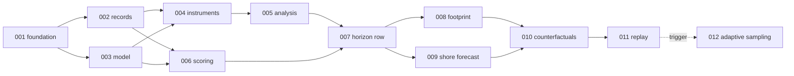

# j-ocean Development Plan

**Status:** Draft 1, 5 September 2026, written at the constitution beat against SRD v1
and constitution 1.0.0.
**Scope:** the sequence of feature beats from an empty repository to the six acceptance
tests of SRD §9, what each beat demonstrates, which gates and ADRs it lands, and the
order in which the SRD's open questions and the review's findings are settled.

This document is a claim about the tree (PR-05). Where the two disagree, the tree wins
and this document is amended.

---

## 1. How the plan works

One feature per beat, in spec-kit order: `specify` (done here for all twelve) → `plan` →
`tasks` → `analyze` → `implement`. The spec is written; the other four artefacts are
produced when the beat starts, not before, because a plan written before the previous
beat has landed is a plan about a tree that does not exist.

Each beat has the same definition of done:

1. Its `plan.md` carries a Constitution Check naming every principle it touches.
2. Every ADR it owes (§4) is merged before its plan is written.
3. Every gate it lands has been watched failing on a planted fixture, and the commit
   says so (PR-04).
4. Its acceptance tests pass headlessly and, where the spec says so, have been watched
   in the shell.
5. It is demonstrable from a clean checkout with one command.

Beats are sequential by default. §3 names the two places parallel work is safe.

## 2. The beats

| # | Feature | SRD | Demonstrates | Gates landed | Acceptance |
|---|---|---|---|---|---|
| 001 | Foundation and ports | NFR-01–03, FR-03, FR-08, §2.1, G-03, G-04, PR-04 | A headless run replays from its manifest; three gates fail on planted violations; the static shell opens and says what it is not | G-03, G-04, vocabulary | AT-04 (headless half) |
| 002 | Truth and observation records | FR-09–11, G-01, §11 | Two domains' artefacts regenerate byte-identically; Argo flags survive; the drift gate fails on one planted byte | G-01 | — |
| 003 | Reduced-gravity model | FR-05–07, FR-04, NFR-04, AT-01 | A recognisable eddy field over 96 h with invariants held; step time measured; budget honoured; derived profile labelled | (G-03 in force) | AT-01 |
| 004 | Simulated instruments | FR-12, FR-24, FR-32, G-02 | Truth becomes observations in one place; the operator maps a profile to an interface depth; G-02 fails on two planted violations | G-02 | — |
| 005 | Analysis and attribution | FR-16–18, G-06, AT-03 (radius) | Optimal interpolation; attribution equals the gain's weights; a cell's breakdown; an observation's influence region | G-06 | (boundary test of FR-12) |
| 006 | Scoring and references | FR-20–22, NFR-05, AT-02 | Skill against two references with provenance; refusal below the resolution floor; skill declines across the row | — | AT-02 |
| 007 | Horizon row | FR-13–15, FR-19, G-05 | Six panels, valid and initialised instants, attribution as a greyscale-legible field, enlarge in place, G-05 fails on a planted mismatch | G-05 | — |
| 008 | Observation footprint | FR-23, FR-24 | Track line with measurements; XBT needles at sampled depths; flagged drawn as flagged; measured beside derived | — | — |
| 009 | Shore forecast, two axes | FR-25–27, §11 | Issue time as one control; the skill curve drops bodily; the departure brief as baseline; outside validity said, not extrapolated | — | — |
| 010 | Counterfactuals | FR-28–34, AT-03, AT-06 | Drag a profile with its ghost; difference field; withhold; break; redraw; revert in one action | — | AT-03, AT-06 |
| 011 | Manifest replay | NFR-02, AT-04 | Export and import across browser contexts, edits included, byte-identical | — | AT-04 (full) |
| 012 | Adaptive sampling *(deferred)* | FR-35–37, AT-05 | Ensemble spread; the paired experiment; the adaptive run losing as a result; the bland domain flat | — | AT-05 |

## 3. Dependencies and milestones

**Parallel work is safe in two places.** After 001, features 002 and 003 touch disjoint
directories (`data/` and `src/model/`) and share only the truth-source port interface
fixed in 001. After 007, features 008 and 009 touch disjoint parts of the harness and
can proceed together. Everywhere else the next beat consumes the previous beat's
published interface and should wait for it.

| Milestone | Beats | What is true when it is reached |
|---|---|---|
| **M0 Governance** | this branch | Constitution 1.0.0, twelve specs, this plan, the SRD review |
| **M1 Foundation** | 001 | Determinism and the structural gates hold; the URL exists |
| **M2 Headless science** | 002–006 | AT-01 and AT-02 pass headlessly; every gate but G-05 is in force; the harness has an answer before it has a picture |
| **M3 The surface** | 007–009 | The row, the footprint, the shore forecast; G-05 in force; a reader can see persistence decay and issue time drop the curve |
| **M4 Something the reader caused** | 010–011 | AT-03, AT-04, AT-06; every counterfactual reversible and replayable |
| **M5 Sampling** | 012 | AT-05; opened only when M4's tests have been watched in the shell |

M2 before M3 is deliberate and is the plan's one strong opinion: the harness should have
scored a forecast against truth before it has drawn one, because a picture arriving first
is the thing that gets trusted before it has earned it (constitution VI).

## 4. ADR schedule

An ADR is merged before the plan of the beat that depends on it (constitution,
Development Workflow). Numbers are assigned here so the specs can cite them.

| ADR | Decision | Written before | Owed by SRD |
|---|---|---|---|
| 0001 | The model tier: one-and-a-half layer reduced gravity, not primitive equations, not quasi-geostrophic | 003 | PR-03 |
| 0002 | The kernel port and the CPU kernel as reference; acceptance tolerance recorded | 003 | PR-03, FR-04 |
| 0003 | The horizon presentation: row, not slider, not grid | 007 | PR-03, FR-13 |
| 0004 | The truth source: HYCOM GLBv0.08 reanalysis over OPeNDAP; fetch/convert split; period | 002 | PR-03, FR-09, review R-5, R-6 |
| 0005 | The observation operator: two-layer thermal structure, interface depth observed | 004 | review R-1 |
| 0006 | The analysis scheme: optimal interpolation with isotropic covariance | 005 | review R-7 |
| 0007 | Argo in the analysis: admitted behind a toggle, caveat on scores | 004 | review R-3 |
| 0008 | Climatology from the subset, with recorded overlap | 002 | §11 |
| 0009 | *Deferred:* dynamic depth levels, with the FR-07 trigger | 003 | §10 |
| 0010 | *Deferred:* GPU kernel, with the FR-06 trigger | 003 | §10 |
| 0011 | *Deferred:* adaptive sampling, with the scoring-trusted trigger | 006 | §10 |
| 0012 | *Deferred:* observation latency and arrival order, with the withhold trigger | 010 | §10 |

Deferral ADRs are written in the *assessed, deferred, cheap to adopt* posture and quote
the SRD's trigger verbatim.

## 5. Gate schedule

| Gate | Holds | Lands in | Kind | Planted violation |
|---|---|---|---|---|
| G-03 | Model imports no rendering | 001 | import lint | `import React` under `src/model/` |
| G-04 | No host time, no unseeded randomness | 001 | source lint with marker | `Date.now()` under `src/model/` |
| Vocabulary | No tracked entities, no customer material | 001 | tracked-file scan | a forbidden word in a fixture |
| G-01 | Artefacts regenerate identically | 002 | build-step diff | one byte changed in an artefact |
| G-02 | Truth only through an instrument | 004 | import lint + single construction site + behavioural test | truth port imported by analysis; second `Observation` constructor |
| G-06 | Attribution from the analysis only | 005 | single construction site | attribution constructed under `src/harness/` |
| G-05 | Declared horizons rendered, no others | 007 | Playwright | seven declared, six rendered |

All run under `pnpm gates`. G-01 is the only gate needing Python, and CI installs it for
that gate alone.

## 6. Settling the open questions and the review findings

| Item | Settled in | How |
|---|---|---|
| §11 two axes without a 2-D control | 009 | The row is the lead-time axis; issue time is the single added control |
| §11 climatology source and independence | 002, 006 | Computed from the subset over a declared window; overlap recorded; caveat on every score (ADR-0008) |
| §11 vertical levels and derived-versus-integrated | 003, 008 | Declared display levels; every level between the model's own tagged derived; drawn beside the measured profile |
| R-1 observation operator | 003, 004 | Two-layer thermal structure; interface depth observed (ADR-0005) |
| R-2 truth coarser than model | 002, 006 | Native resolution recorded; scoring refuses below it; SRD §4 note to be corrected by the author |
| R-3 Argo's role | 004, 006, 008 | Admitted behind a toggle; caveat; footprint says "drawn, not assimilated" when off (ADR-0007) |
| R-4 fresh run vs recorded case | 001 | Default seed declared; "new run" draws entropy once |
| R-5 drift gate and the network | 002 | Fetch and convert split; gate runs from the digest-verified raw subset |
| R-6 the period | 002 | Declared, with schema-enforced arithmetic; author chooses the dates |
| R-7 the covariance | 005 | Optimal interpolation, isotropic, declared length scale (ADR-0006) |
| R-8 shore forecast producer | 009 | Same model from the analysis at issue time |

Three of these are the author's to overturn: R-3 (whether Argo is assimilated at all),
R-6 (the dates), and R-2 (the correction to the SRD). The specs carry them as
assumptions so that overturning one is an edit to a spec, not a rewrite.

## 7. Feasibility arithmetic

Recorded so that the frame budget is a number and not a fear.

- Reduced gravity 0.02 m/s² over a 500 m upper layer gives a gravity-wave speed of about
  3 m/s. On 5.5 km cells the explicit stability limit is a timestep of order 20 minutes;
  the plan for 003 will use 10 minutes for margin.
- 96 h at 10 minutes is 576 steps of 10⁴ cells with three prognostic fields. On the
  development machine this is milliseconds per horizon, tens of milliseconds for the row.
- A counterfactual re-runs the analysis (an optimal interpolation with tens of
  observations: a small dense solve) and the row: well under a second.
- The ensemble of feature 012 multiplies the row by N. At N = 32 it is still under the
  budget at 100 × 100; the budget will bind first when the resolution study of FR-06
  raises the grid, which is what §10's GPU trigger is for.
- The HYCOM subset: a five-degree box at 1/12° is about 60 × 60 cells; at, say, 10 depth
  levels and 3-hourly for 14 days that is 4 M values per variable, 16 MB in float32
  per variable. Three variables and two domains approach 100 MB of raw subset. The 002
  plan decides between committing that and caching it outside the tree with the digest
  committed (review R-5). The converted artefact can be smaller by carrying only the
  levels the display declares.

## 8. Risks, in order

1. **The observation operator is wrong in a way that only shows when a reader drags a
   profile (R-1).** Mitigation: 004's operator test recovers the truth interface from a
   zero-noise profile before any surface exists; AT-06 is watched in the shell, not
   inferred.
2. **HYCOM's resolution bounds the whole study (R-2).** Mitigation: recorded as a
   declared value from the first artefact; the tighter-box study is bounded and said so.
3. **The bland domain is not bland enough, or the Gulf Stream domain in the chosen period
   is not eventful enough (FR-11, R-6).** Mitigation: 002's variance-ratio test with a
   declared factor, and the author's choice of dates is informed by it.
4. **G-01 in CI depends on a 100 MB input.** Mitigation: R-5's split; the decision is in
   002's plan and carries a Complexity Tracking entry if the raw subset is committed.
5. **WebGL costs more than it returns at 100 × 100 (R-8).** Mitigation: one rendering
   module, so the choice is cheap to revisit; ADR-0003 records why it was kept.
6. **Optimal interpolation's isotropic covariance draws an influence radius that is a
   property of the configuration, not the ocean (R-7).** Mitigation: the radius is
   labelled declared, never computed, and the spread field of 012 is the flow-dependent
   answer when the trigger is met.

## 9. Next actions

1. Author reviews `docs/srd-review.md` and answers R-3, R-6 and R-2.
2. Write ADR-0001, ADR-0002, ADR-0004 and ADR-0008; then `/speckit-plan` for 001.
3. Land 001; watch its three gates fail; open M1.
