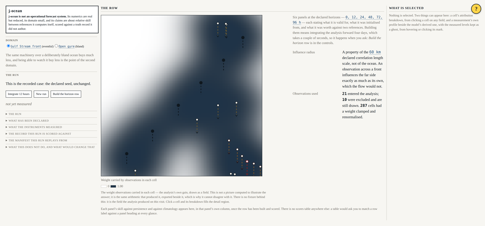

# Beat 001: a foundation you can watch fail

The first beat of j-ocean delivers no ocean. It delivers the shape every later beat fills
in, and the proof that the shape is enforced. Three decisions in it are worth writing down,
because each one was a choice between something obvious and something slightly awkward, and
in all three the awkward option was right.

## The manifest holds no state

A run manifest records the root seed, every derived seed, the generator version, the clock
configuration, the configuration digest and the step count. It does not record the fields.

The obvious design records a snapshot, because then "replay" is fast and cannot go wrong.
That is exactly the problem: a snapshot compared with itself proves nothing. What the
requirements ask for is that a run *reproduces* from its manifest, and the only test of
that is to rebuild the run by re-computation and compare the result byte for byte.

```
tests/run/replay.test.ts
  rebuilds a run from its manifest byte-identically at 1,000 steps
  replays a run that was itself started from a drawn seed
  does not replay a different seed into the same state
  does not replay a different number of steps into the same state
  advances in pieces exactly as it advances in one call
```

The last three are the ones that matter. A determinism test with no negative half passes
just as happily when the machinery is broken.

## Streams are named, not counted

The RNG port hands out named streams. A stream's seed is derived from the root seed and the
stream's name — `splitmix64(rootSeed XOR fnv1a64(name))` — and never from a counter or a
call order.

Two properties fall out of that rather than being arranged. A component's values do not
depend on whether some other component drew first, so adding a draw in one place cannot
silently change the numbers somewhere else. And asking twice for the same name replays that
stream *from the start*, because `stream(name)` is a construction and not a lookup.

A single shared generator handed out to callers has neither property, and a run whose
determinism depends on call order is reproducible in theory and not in practice.

## The trivial kernel draws from its stream

Beat 001's kernel is a placeholder: a scalar tracer diffusing on a periodic grid, replaced
outright by the reduced-gravity model in beat 003. It would have been simpler to make it
purely deterministic arithmetic.

It draws two values from its stream every step instead, and that is deliberate. A kernel
that ignored its stream would replay identically no matter how broken the RNG was, and the
replay test would pass for the wrong reason for however many beats it took somebody to
notice.

## The gates, watched failing

A check that has never been seen to fail is worth nothing. Each of the three gates in this
beat was planted with a violation, watched failing, cleaned, and watched passing:

```
FAIL  G-04 host time and unseeded randomness  (1 file scanned)
      src/model/planted.ts:3:10  Date.now is a host read; constitution Principle I:
      simulation time comes from the clock port and every generator from the RNG port
        return Date.now() - startedAt;
```

`tests/gates/gates.test.ts` keeps doing it, and spawns each gate as a *program* rather than
calling its function, so that an argument-parsing or exit-code mistake is caught too. It
also asserts each gate scanned a non-zero number of files, because a gate that passes
because its walk found nothing is the most comfortable kind of broken.

### The word list problem

The vocabulary gate holds a list of words that must not appear in the repository. Some of
those words are customer names, which must not appear in the repository — including in the
word list.

So the list has two halves. The tracked-entity vocabulary is plaintext, with a reviewed
exemption for the documents whose subject *is* the prohibition. Customer material is a
salted SHA-256, checked by hashing every word and adjacent word pair of every scanned file,
with no exemption anywhere. A hit on the hashed half is reported without quoting the line
back:

```
FAIL  forbidden vocabulary  (1 file scanned)
      src/planted.md:4  a term on the hashed forbidden list appears here (Principle VII)
        (the line is not quoted, because the word on it must not be)
```

## What the shell says



The page states its seed, whether this is the recorded case, and the manifest it would
replay from. The statement of what j-ocean is not is the first thing in the document and
has no dismiss control, because nothing about it stops being true while the page is open.

Declared, computed and host-time figures are typographically distinct from this beat
onwards, so that the horizon row in beat 007 inherits the convention rather than inventing
one.

## What it cost

Fourteen source files, seven Playwright tests, seventy-one headless ones, and a CI failure
worth recording: the shell job timed out waiting on its own preview server, because
Playwright polled `127.0.0.1` while `vite preview` had been left on its default host of
`localhost` — which on a GitHub runner resolves to `::1` first. The development machine has
no IPv6 loopback at all, which is precisely why the same command passed locally and hung in
CI. Naming the host on both sides removed the resolution from the question.

Next: the truth record. Two external datasets, both freely obtainable, converted at build
time and committed as derived artefacts with a drift gate over them.
