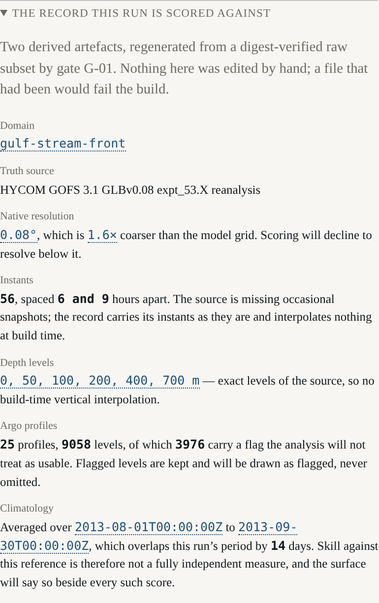

# Beat 002: a truth record you can regenerate

The harness's claims are worth what its truth record is worth, so this beat is mostly about
making that record something you can check rather than something you have to believe.

## Two scripts, and the reason there are two

`fetch.py` touches the network. `convert.py` does not. That split is the whole design.

A drift gate that re-fetched from a server would be testing the server. A drift gate that
re-converts a committed input is testing the tree, which is the only thing it can usefully
test. So `fetch.py` writes a SHA-256 for every raw file into `data/raw/digests.json`, and
`convert.py` refuses to run when a file does not match:

```
upstream changed: truth/gulf-stream-front/surf_el.nc
  recorded  9c2e...
  on disk   3f81...
Nothing was written. Either the upstream product changed, in which case re-run
data/scripts/fetch.py and commit the new raw file and digest, or the file was
edited by hand, which no file under data/raw/ ever should be.
```

A difference is therefore attributed to the upstream or to the tree, never guessed at.

The raw subset is committed — about 8 MB across both domains. That is a real cost in a
repository that will otherwise stay small, and it buys a gate that needs no network, no
credentials and no cache: a fresh checkout can regenerate every artefact and prove it.

## The route to the data was not the one the spec named

The spec says the subset is taken over OPeNDAP. It is taken over the NetCDF Subset Service
instead, and the reason is a measurement rather than a preference:

| Route | What happened |
|---|---|
| DAP, through `xarray` or `netCDF4` | The client must read the metadata of a 2884 x 40 x 3251 x 4500 aggregation before it can slice. Timed out at 120 s, twice, without returning. |
| NCSS, one URL with box, period, stride and level | 273 KB for sea-surface elevation, 333 KB per temperature level, in 13 to 15 seconds. |

Both are THREDDS services and both subset server-side, which is what the requirement is
protecting. The spec sentence is a claim about the tree, and the tree wins.

## Two nine-hour holes in the ocean

The first test written against the artefact asserted a uniform six-hour spacing. It failed:

```
expected 32400000 to be 21600000
```

Nine hours where six was expected. HYCOM's expt_53.X reanalysis is missing about
thirty-six of its 2 920 annual snapshots, so a six-hourly stride lands on a nine-hour step
twice in this particular fortnight.

The spec's edge case says the fetch step should fail and name the missing instants. Taken
literally that makes the beat impossible: at roughly 1.4 missing snapshots per fortnight,
essentially every period fails. But what the requirement protects is that *a gap is never
silently interpolated*, and there is a way to keep that promise without pretending the ocean
is regular:

- the instants are recorded as the source has them, gaps included;
- `instantSpacingHours` in the provenance states which spacings actually occur;
- the build refuses any gap larger than a **declared** maximum (`maxInstantGapHours`, 12 h),
  naming the instants — so a genuinely missing day still fails;
- and the surface says it out loud rather than leaving a reader to assume regularity.

The test now asserts the irregularity is bounded and recorded, rather than asserting an
evenness the ocean does not have.

## int16, on purpose

The committed container stores its payload as `int16` with a declared scale and offset. It
would have been easier to widen everything to `float32` on the way in.

That would double the artefact — from about 3.2 MB to 6.4 MB per domain — in order to invent
precision the source does not have. HYCOM stores these fields as `int16` with a scale of
0.001; carrying the same quantisation means the committed record has the source's precision
and neither more nor less. The reader multiplies and adds. Land carries a declared fill value
and becomes `NaN`, never a plausible number.

## What the record actually contains



Two figures from the test output are worth writing down, because later beats lean on both.

**The domain contrast is real.** Sea-surface height standard deviation is 0.4317 m in the
Gulf Stream box and 0.0579 m in the open gyre — a variance ratio of **55.7**, against a
declared minimum of 4. The bland domain is genuinely bland, which matters because beat 012 is
supposed to be able to show that adaptive sampling in a uniform ocean buys nothing. If the
"uniform" ocean had a front in it, the harness would appear to win for the wrong reason.

```
gulf-stream-front (eventful): variance 1.864e-1 m^2, standard deviation 0.4317 m
open-gyre (bland):            variance 3.347e-3 m^2, standard deviation 0.0579 m
ratio 55.70, declared minimum 4
```

**The Argo record is sparse.** Twenty-five profiles over fourteen days in a five-degree box,
thirteen in the other. Of 9 058 levels in the Gulf Stream box, **3 976 carry a flag the
analysis will not treat as usable** — and every one of them is kept. A flag is never spent at
build time deciding what to keep, because beat 008 has to draw a flagged observation *as*
flagged, and a reader who cannot see the flagged ones cannot see what the analysis chose to
ignore.

That sparsity is not a shortfall to engineer around. It is the fact the harness exists to
teach about.

## The flag test that would have been worthless

The obvious test — "count the flags in the committed record, assert there are some" — checks
nothing. So `convert.py` computes a flag histogram from the raw NetCDF arrays *before*
conversion and writes it into the provenance, and the TypeScript test computes the same
histogram from the committed record and compares. Two independent computations of one fact,
which is the only arrangement under which that assertion is worth making.

## G-01, watched failing

```
FAIL  G-01 artefact drift  (6 files scanned)
      truth/gulf-stream-front.jocean:1  this artefact does not regenerate from its
      raw input. Either the convert step changed, in which case re-run it and commit
      the result, or the artefact was edited by hand, which no derived artefact ever
      should be (Principle IX).
        committed 3218328 bytes, regenerated 3218328 bytes;
        first difference at byte 1609164
```

One byte. The gate's fixture is built in a temporary directory rather than committed, because
a second copy of ten megabytes of derived data would be a fixture of a fixture.

G-01 also interlocks with the vocabulary gate. That gate now skips the artefact directories —
they are build outputs, not writing, and hashing every word and adjacent word pair of three
megabytes of JSON is expensive for no gain. What makes the skip safe is that a hand-written
file placed among the artefacts fails *G-01*, because the convert step does not produce it.
Neither gate is weakened; each covers the other's exclusion.

Next: the ocean itself. A one-and-a-half layer reduced-gravity model, and the first thing in
this project that will actually be worth looking at.
