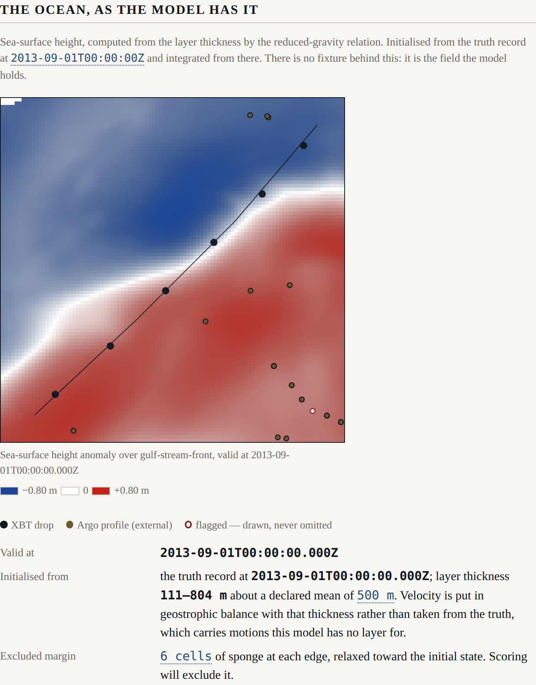

# Beat 004: the gate's first catch was ours

Constitution Principle II says the model never sees truth except through a simulated
instrument, that the `Observation` type is opaque, and that it has a single construction
site. Beat 004 is that module, and gate G-02 is what makes the rule enforceable rather than
aspirational.

The first thing the gate caught was a violation this project had already committed.

## `src/model/initialise.ts`

Beat 003 needed to initialise the model from the truth record. FR-013 says, in terms, that
initialisation must go through the truth-source port and must not import the artefact
directly. So `initialiseFromTruth` took a `TruthSource`, and it lived under `src/model/`.

The constitution says, also in terms:

> The model and the analysis import neither the truth port nor the scoring module.

Both are satisfiable at once, and neither is satisfiable where that file was. The **run**
does the wiring: it holds the truth source, it holds the model, and it hands the one to the
other. `src/run/initialise-from-truth.ts`.

Where a spec and the constitution disagree, the constitution wins and the spec is amended.
That rule is easy to write down and, it turns out, easy to forget for a beat.

The fixture that would have caught it is now committed, so the gate keeps watching:

```
FAIL  G-02 truth boundary  (2 files scanned)
      src/model/planted.ts:6  src/model/ imports "../ports/truth-source.js":
      the truth-source port; only src/instruments/ may hold it to produce
      observations, and src/scoring/ to score after the fact.
      Constitution Principle II: the model and the analysis import neither the
      truth port nor the scoring module.
```

## Making the type impossible to forge

The opacity is not a comment. `Observation` carries a brand keyed by a symbol that
`src/instruments/observation.ts` declares and never exports:

```ts
declare const OBSERVATION_BRAND: unique symbol;

export interface Observation {
  readonly [OBSERVATION_BRAND]: true;
  // ...
}
```

A module that cannot name the key cannot build the type, and TypeScript will not let it
pretend. The gate holds the other half: it fails if `OBSERVATION_BRAND` appears in any file
but that one, which is what stops somebody reintroducing a cast in six months' time. Both
halves were watched failing on planted fixtures before either was trusted.

## Two configurations that defeated themselves

**A quality-control threshold below the instrument's own noise flags the instrument.** The
declared vertical-inversion tolerance was 0.05 °C. The XBT's total error is
`hypot(0.1, 0.2) = 0.224 °C`. In the weakly stratified water below 500 m, noise alone
produces apparent inversions of a tenth of a degree all the time — so *every* real profile
tripped the check, and the flag meant nothing.

The fix is not a bigger number, it is a number the schema can defend:

```ts
.refine((c) =>
  c.instruments.qualityControl.verticalInversionToleranceDegC >
  2 * Math.hypot(xbt.noiseStandardDeviationDegC, xbt.representativenessStandardDeviationDegC),
  { error: 'the check would flag the instrument rather than the ocean' })
```

The declared tolerance is 0.6 °C, and a configuration that would flag its own instrument is
now a startup failure.

**An XBT can reach past the end of the truth record.** A probe infers its depth from a fall
rate, so one asked for 700 m may reach 703 m — and the record stops at 700. Three of
seventy-eight levels did this on the first run, and the truth source refused them, correctly.

There were three ways to respond and only one of them is honest. Clamping the depth reports a
measurement from a place the harness has no record of. Dropping the level hides a hole. So
the level is kept, valueless, flagged `outside-record`:

> the probe reached 703.2 m and the truth record does not cover it

A reader looking at a profile with a gap in it can now tell whether the gap belongs to the
ocean or to the record. And the noise draw still happens for that level, so an overshoot does
not silently shift every later draw in the stream.

## Why the operator observes a depth

ADR-0005 had two candidates. An operational system would more likely project the temperature
anomaly onto a fixed vertical mode; this harness inverts the two-layer relation it already
uses to *draw* a profile, and observes the interface depth.

The reason is the error propagation, not the tidiness. Differentiating the inverse gives

    |dh/dT| = 2L / (|T_deep − T_upper| · (1 − f²))

which **diverges** as `f` approaches ±1 — that is, as the measurement leaves the thermocline
and enters the body of a layer. A level that constrains nothing acquires an enormous depth
error and a weight near zero through the arithmetic, rather than through a rule somebody
remembered to write. There is a test that adds ten useless levels to a three-level profile
and asserts the answer does not move.

Where **no** level resolves the interface, the operator does not produce a depth at all. It
reports a bound:

```
this profile does not cross the thermocline; it establishes only that the
interface is below 150 m
```

That is a fact. A depth there would not be.

From real drops, with declared noise:

```
interface at 200 m recovered as 200.0 m (±0.7 m) from 9 levels
interface at 350 m recovered as 350.0 m (±0.9 m) from 5 levels
interface at 500 m recovered as 500.0 m (±0.8 m) from 5 levels
```

## What the water actually holds



The line is the ownship, crossing the front over three days. The filled circles are its XBT
drops. The olive circles are the real Argo profiles that were in that box during that
fortnight, and the white one with a red ring is flagged — drawn as flagged, never omitted,
because what the analysis chose to ignore is exactly as interesting as what it used.

Note how few Argo profiles there are, and note that this is not a limitation of the harness.
That is the ocean's actual sampling density.

## Argo is admitted, with the dependency stated

ADR-0007 settles review R-3 provisionally, and the provisional part is the point. Argo is
assimilated behind `instruments.argo.assimilate`, defaulting to true, and every observation
derived from it carries `external: true`.

The reason `external` exists is that **the truth record assimilated these same profiles**.
Skill measured against HYCOM while assimilating the Argo profiles HYCOM assimilated is not
independent evidence, and the surface says so beside the figure rather than in a document the
surface does not carry. Setting the default to false is a one-line configuration change and
no code change at all, which is the property the decision was designed to have.

## What the surface says now

Every observation's error is three declared parts rather than one opaque figure: what the
device does, what a point sample of the real ocean cannot know about a 1/12-degree six-hourly
record, and what a broken instrument adds. Beat 005 weights by the total; the surface can say
which is which.

The bias goes in **after** noise and **before** the checks. That ordering is FR-007's and it
matters: a bias added after the checks would be a bias quality control could never catch,
which would make beat 010's "break an instrument" a demonstration of nothing.

## G-02's missing half, said out loud

The behavioural half of G-02 — an analysis with instrument error set arbitrarily large
recovers nothing of truth beyond the background — needs an analysis, and the analysis is beat
005. The gate prints that on every run:

```
PASS  G-02 truth boundary  (37 files scanned)
      note: the construction site is src/instruments/observation.ts
      note: behavioural half (an analysis with arbitrarily large instrument
            error recovers nothing beyond the background): not yet landed, beat 005
```

A hole with a date on it, rather than a hole nobody mentions. There is a test asserting the
gate still says it.

Next: the analysis, its attribution weights, and the half of G-02 that has been waiting.
