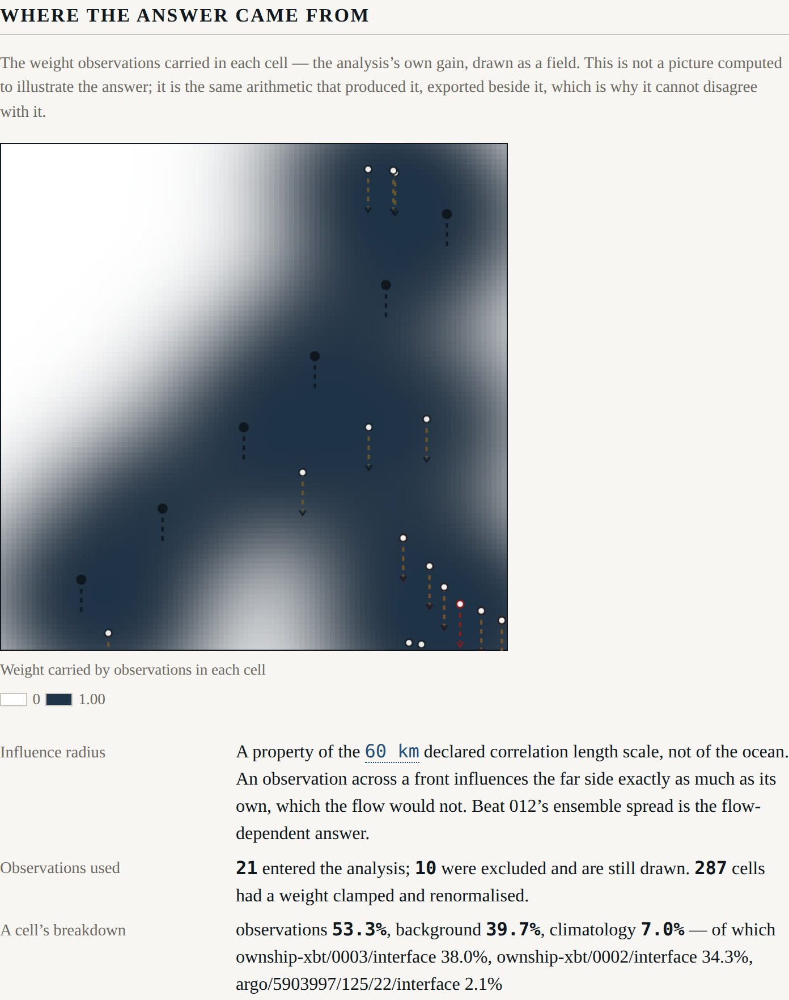

# Beat 005: a share of 202 per cent

The analysis combines a background, some observations and a climatology, and in doing so
decides how much each was worth in each cell. Constitution Principle IV says those decisions
*are* the attribution field — not a picture computed to illustrate the answer, but the same
arithmetic that produced it.

That is a stronger requirement than it sounds, and it is why ADR-0006 chose optimal
interpolation over 3D-Var, which gives identical numbers by a route that does not hand you
them.

## The identity the whole beat rests on

Write the analysis as

    x_a = (I − K H) x_p + K y

`H` selects the cell an observation sits in, so `H·1 = 1`, and therefore at every cell

    Σ_k (I − K H)_ik + Σ_j K_ij = 1

**The row sum of the gain is the weight the observations carried there.** One minus it is the
prior's weight, which the declared blend splits between background and climatology. Nothing
is estimated, smoothed or normalised by hand.

The test does not assert the attribution is plausible. It recomputes the weights from the
gain by a different piece of code and asserts they are *equal*:

```
largest difference between gain row sum and exported weight: 0.000e+0
```

An attribution that agreed with the analysis only approximately would be a picture that could
disagree with it.

## Then the first real run

```
observations 63.1%, background 31.4%, climatology 5.5% — of which
argo/5903997/123/14/interface 202.5%, argo/5903997/121/7/interface 86.2%,
ownship-xbt/0003/interface 48.5%
```

A single observation carrying **202 per cent** of a cell's weight, against others carrying
negative shares in the same cell. And 1 342 of 10 000 cells with a total weight outside nought
and one.

Row sums slightly outside `[0, 1]` are a known feature of optimal interpolation. Shares of two
hundred per cent are not. Something was wrong.

## An observation's formal error is not what it is worth

It was not the code. It was a number nobody had declared.

Beat 004's observation operator propagates an interface-depth error from the temperature
errors, and it does that correctly:

```
interface at 350 m recovered as 350.0 m (±0.9 m) from 5 levels
```

**±0.9 m is genuinely what the instrument could not know.** It is nothing like what the
observation is worth to a grid of 4.5 km cells. A point sounding of the thermocline differs
from a cell's *mean* interface depth by tens of metres of mesoscale variability, and no
thermometer, however good, could have resolved that.

So the analysis believed each observation about fifty times more than the background. Two
Argo profiles twenty kilometres apart, each trusted to a metre, became nearly collinear
constraints inside a covariance with a 60 km length scale — and an ill-conditioned system does
exactly what this one did: enormous positive and negative weights that very nearly cancel.

`analysis.interfaceRepresentativenessMetres` is now a declared value, 25 m, added in
quadrature with the propagated error:

| | Before | After |
|---|---|---|
| Largest single share | **202.5 %** | 78.9 % |
| Most negative share | large | −18.8 % |
| Cells clamped | 1 342 (13 %) | 287 (2.9 %) |

The lesson generalises past this project. **The formal error an operator propagates is a
lower bound on an observation's error, and using it as the whole of the error is a way of
telling an analysis to trust a measurement more than the measurement deserves.** Operational
systems call the difference representativeness error, and they declare it, and now so does
this one.

## What the test asserts, and what it deliberately does not

287 clamped cells remain, and the test does not demand zero. Optimal interpolation with a
Gaussian covariance and clustered observations genuinely produces row sums a little outside
nought and one in the shadows between them; that is a property of the scheme. The spec's own
edge case anticipated it and asked for the clamp count to be a **published diagnostic** rather
than for the clamp never to fire. So it is on the surface, and the test bounds it below five
per cent of the domain.

The "perfect observation" scenario also changed, and the new assertion is stronger than the
one it replaced. The spec says a zero-error observation gives the analysis its own value. With
representativeness declared, a zero-*instrument*-error observation carries

```
80.0% of the weight at its own cell, against a background error of 50 m
and a declared representativeness of 25 m
```

which is exactly `σ_b² / (σ_b² + σ_r²)`. The test asserts that identity rather than the
approximation the spec described.

## Where the answer came from



Two presentation decisions in that picture are load-bearing.

**A sequential palette, not a diverging one.** The anomaly fields use blue–white–red because
the sign is the meaning. A weight has no sign — it runs from nothing to all of it — so a
diverging scale would give it a blue half that means nothing. Monotone lightness is also what
makes it greyscale-legible, which FR-17 requires of exactly this field.

**The breakdown appears only for a selected cell.** FR-16 forbids a per-panel summary bar as
the primary attribution display, and the SRD says why: it was specified first and was wrong. A
summary can be computed from something other than the analysis; a field drawn from the gain
cannot. G-06 enforces it — the gate fails if anything under `src/harness/` so much as contains
a function producing an attribution.

## The half of G-02 that had been waiting

Beat 004 landed gate G-02's two static halves and printed, on every run, that the third was
not there yet. It is now:

```
with observation errors at 1e9 m: largest departure from the no-observation
blend 7.958e-13 m; largest observation weight 5.831e-15
```

A gate that reads source cannot check that. An implementation could import nothing forbidden
and still leak truth through some path nobody thought of, and only running it would show.

## What does not enter the analysis, and why

The ownship's surface thermometer takes 25 measurements along the track, and **none of them
enters the analysis**. In a two-layer model the surface temperature is the upper layer's own
declared temperature: it does not depend on where the interface is, so it constrains nothing.
The operator reports every one as unresolved, and the analysis record excludes them with that
reason attached.

That is not a shortcoming of the instrument. It is a fact about the model that the harness
exists to make visible — and a preview of what beat 006 will be asking about every figure on
the screen.

Next: scoring. Skill against persistence and against climatology, with the caveat ADR-0007
promised, and the first opportunity for this harness to report that it is worse than a
reference.
