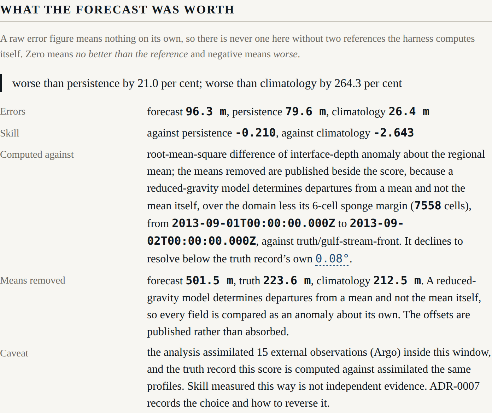

# Beat 006: the harness loses

Constitution Principle VI says the harness is built so that failure is a reportable result,
and that a path by which the model cannot be shown to be worse than persistence is a defect.
Up to this beat that was an aspiration. This is the beat where it got exercised, and the
answer came back:

```
worse than climatology by 247.8 per cent
```

The surface prints that verbatim. It has no way to phrase it more kindly, because the sentence
is constructed in the scorer and rendered as-is.

## First, the error was mostly an offset

The first scored run gave a forecast error of 141 m and a climatology error of 27 m. That
disparity was suspicious, and it was: both figures were dominated by a *bias*.

The model's mean interface sits at 331 m — a declared 500 m layer, modulated by sea-surface
height. The thermocline that the two-layer operator diagnoses from the truth record sits at
224 m. A hundred metres of the hundred and forty being reported was that difference.

A reduced-gravity model has no absolute reference for its free surface. That is exactly why
the domain mean is removed at initialisation, and scoring has to use the same convention or it
measures an offset that neither field claims to determine.

| | Raw | As anomalies |
|---|---|---|
| Forecast error at 24 h | 135 m | **79 m** |
| Skill against persistence at 24 h | 0.036 | **0.145** |

The means removed are published beside every score. A reader is entitled to know that the
model's mean interface is a hundred metres deeper than the truth's, and to decide for
themselves what that means.

## Then, the model still loses to a two-month average

Even compared as anomalies, the model's error is 79 m and climatology's is 28 m. A mean over
sixty-one days of the same box beats a four-day forecast comfortably, at every lead time.

The reason is an amplitude mismatch between two numbers that were declared separately and
never checked against each other.

The model maps sea-surface height to interface depth by `g/g'`, which with a reduced gravity of
0.02 m/s² is **490**. A ±0.5 m sea-surface anomaly therefore becomes ±245 m of interface
displacement. The truth's thermocline, as the declared two-layer structure diagnoses it, moves
about ±50 m across the same front.

**The model's anomaly is roughly three times too large.** Nothing in the code is wrong; two
declared numbers disagree about the same ocean.

The obvious move at that point is to lower `g'` until the amplitudes match and the skill figure
improves. That would be fitting the model to its own score, and it would make this test suite a
description of what somebody hoped for. It is recorded as a finding for the author instead. It
is a configuration change and a re-run, not a code change — which is the property Principle X
exists to give.

## And the skill curve does not decline

AT-02 expects skill against persistence to fall across the row. Here is the row:

```
  0 h  forecast 91.9 m  persistence 91.9 m  climatology 26.4 m  |  0.000  -2.478
 12 h  forecast 80.0 m  persistence 92.2 m  climatology 26.7 m  |  0.133  -1.994
 24 h  forecast 79.1 m  persistence 92.6 m  climatology 27.6 m  |  0.145  -1.863
 48 h  forecast 83.7 m  persistence 92.3 m  climatology 27.6 m  |  0.093  -2.032
 72 h  forecast 79.3 m  persistence 94.7 m  climatology 26.7 m  |  0.163  -1.965
 96 h  forecast 81.8 m  persistence 96.8 m  climatology 30.0 m  |  0.155  -1.730
```

It rises. 0.133 at twelve hours, 0.155 at ninety-six.

The figures say why. The forecast's error sits at about 80 m at *every* lead time, while
persistence's grows slowly from 92 m to 97 m — so the ratio improves with lead time. The
forecast error is dominated by the standing amplitude mismatch above, not by anything that
decays, and four days is not long enough for lead-time decay to become the larger of the two.

The test asserts what is true, prints the six figures, and says out loud that AT-02's decline
is absent:

> AT-02 expects this to be non-increasing. It is not: 12 h gives 0.133 and 96 h gives 0.155.
> The forecast error is roughly constant across the row while persistence's grows slowly, so
> the ratio improves. This is recorded as a finding for the author, not asserted away.

There was a tolerance available that would have made "non-increasing" pass — the values wander
by about 0.07, so a tolerance of 0.08 would have done it. That tolerance would have been larger
than the quantity being measured, and it would have hidden the one interesting thing in the
row.

## What did work

Two things, and the second is the one this project exists for.

**The identities hold.** A forecast equal to the initial field scores exactly zero against
persistence. A forecast equal to truth scores one against both. A deliberately bad forecast
scores negative *and* the statement contains the words "worse than persistence". A perfect
reference gives `null` and the words "persistence is perfect here", rather than infinity.

**A measurement is worth something, locally.** AT-03's scoring half:

> Within 120 km of the third XBT drop, skill against persistence is **0.335** over 1 836 cells.
> Outside it, **0.110** over 5 722.

That is the harness doing the thing it was built to do: pricing a measurement, in the
neighbourhood where it was taken.

## Provenance, because a score without it is an assertion



A `Score` cannot be constructed without provenance — reference, region, margin, window, metric,
resolution floor, truth source, and the independence caveat. Every number on it is a `Figure`
carrying its kind, and a test round-trips the whole object through JSON and asserts the kinds
survive.

The caveat, printed beside the figure and not in a document the surface does not carry:

> the analysis assimilated 15 external observations (Argo) inside this window, and the truth
> record this score is computed against assimilated the same profiles. Skill measured this way
> is not independent evidence. ADR-0007 records the choice and how to reverse it.

And four refusals rather than four plausible numbers: a region finer than the truth's own
resolution (*"scoring inside it would be scoring interpolation, not the ocean"*), a valid
instant outside the record, a region with nothing in it, and division by a perfect reference.

## M2

That completes **M2, headless science**: the harness has an answer before it has a picture. It
is not the answer anybody was hoping for, which is rather the point — the first thing this
machinery did once it could score anything was tell us that the model we had just built is
worse than an average.

Next: the horizon row. Six panels, the attribution as a field, and gate G-05 checking in a
running browser that every declared horizon is drawn and no other.
