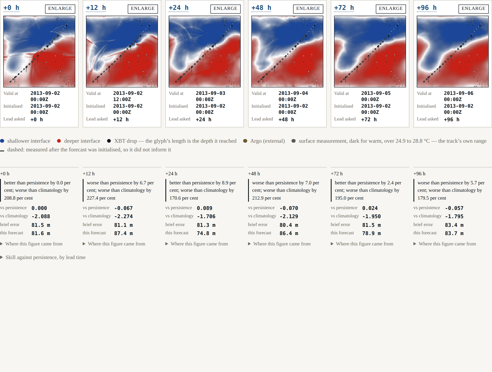
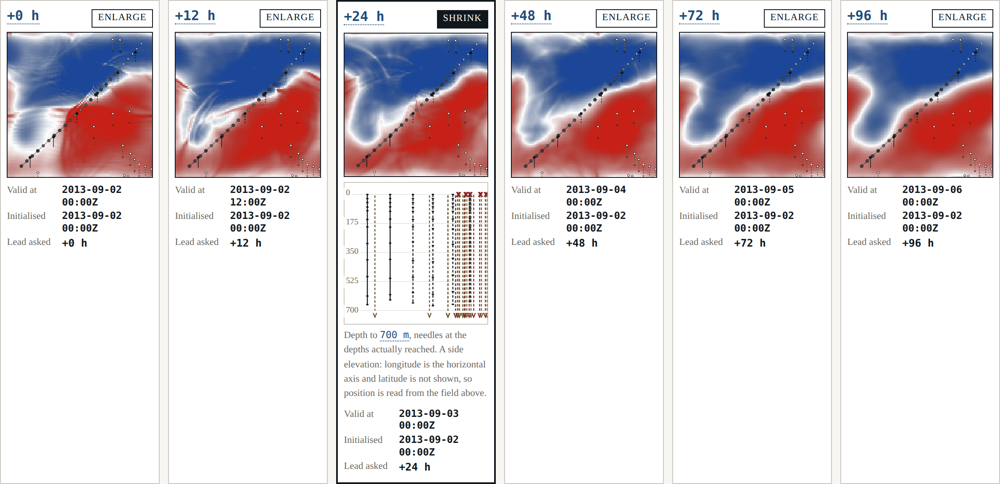
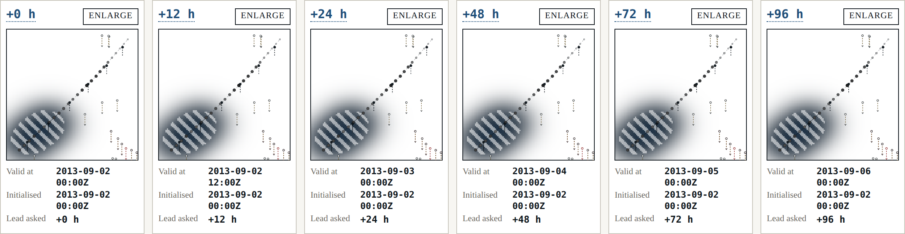

# Beat 007: six panels, and the test that was counting instead of measuring

The harness has had an answer since beat 006. This is the beat where a reader can see it: six
panels, one per declared horizon, left to right in lead-time order, each stating what instant
it is valid for, what it was initialised from, what its skill is against both references, and
where its answer came from.



## Why a row

ADR-0003 records the argument, and it is short. A **slider** shows one lead time and asks the
reader to remember the others; what is not on screen is what the eye forgets, and a claim
about a trend delivered one frame at a time is a claim taken on trust — which is the thing
this harness exists not to require. A **grid** loses the axis: lead time is one-dimensional
and monotone, and two rows of three invents a second ordering the data does not have while
putting +24 h directly above +96 h.

The row keeps the axis and pays for it in panel size. Enlarge in place is the answer to that,
and it is deliberately not a modal — an enlargement that hid the row would be a slider with
extra steps.



## The row passed its tests and did not fit

The first version was tested: six panels, in horizon order, each with its instants and its
scores, asserted in a browser. All green. It was also showing four and a half panels.

The page's prose column is 46 rem, six panels at a legible width need about 1 200 px, and the
row had quietly become the thing the spec allows only as a last resort — a container that
scrolls. The gate that exists for exactly this area, G-05, did not catch it either, and
correctly so: G-05 asks whether the rendered horizons are the declared ones, and they were.

The test was asserting membership and order, because those are easy to assert. **"All visible
at once" is a claim about geometry, and nothing in the suite was measuring geometry.**

The fix is not a wider stylesheet. The geometry is now declared —

```json
"presentation": {
  "referenceViewportWidthPx": 1400,
  "minimumPanelWidthPx": 190,
  "panelGapPx": 10,
  "pageGutterPx": 48
}
```

— handed to the stylesheet as custom properties so that no width is a literal in CSS, and
three things now check it:

- the **schema** refuses a configuration whose reference width cannot hold every declared
  horizon at the declared minimum. Adding a seventh horizon without widening the row is a
  startup failure with the arithmetic in the message, not a row that silently scrolls;
- a **browser test** sets the window to the declared reference width and measures the
  rendered boxes: the row may not scroll, every panel must be at least the declared minimum
  wide and inside its container, and the *page* may not scroll horizontally at all;
- the **screenshot above** is captured at that same declared width, so a figure in this post
  cannot show a row that fits when the shell's does not.

That last one matters more than it looks. A documentation site whose figures are captured at
a flattering window is a documentation site that will eventually disagree with the product.

## The fallback nobody had ever run

FR-010 confines rendering to one module so the choice is cheap to revisit. It uses WebGL2
where it exists and falls back to canvas2d where it does not.

Headless Chromium here *has* WebGL2 — ANGLE over SwiftShader — so every test took the fast
path, and the fallback was code that had never executed anywhere. "A check that has never been
seen to fail is worth nothing" cuts both ways: a fallback that has never been seen to run is
worth nothing either. So one test refuses `getContext('webgl2')` in an init script, asserts
the surface reports `canvas2d`, and counts distinct colours to confirm it painted a field
rather than a rectangle.

## Attribution, and the second channel

Each panel can show where its answer came from: the weight observations carried in every cell,
read from the analysis's own attribution and computed nowhere else. Colour alone would not
survive a monochrome print, so the cells where observations lead both other sources are
**hatched** — a second channel, in the shader, keyed on the analysis's weights.



The greyscale claim is measured rather than asserted. A test reads the rendered pixels, takes
the luminance of an observed patch and of the unvisited north-west corner, and requires the
difference to clear a declared margin of 40 in 255. It measures **150.0**.

## What this beat could not do, and says so

The spec expects a cell's background and climatology weights to differ between horizons. They
cannot yet: the recorded case runs **one** analysis, at the issue instant, and the row draws
that one field on all six panels.

Six identical fields side by side is a picture that implies six analyses. The row therefore
says, in the legend, that it is the same field on every panel, names the instant it was
analysed at, and says attribution becomes per horizon once the forecast cycles — which is beat
009's job.

The alternative was to synthesise a per-panel attribution by decaying the weights with lead
time. It would have looked better and it would have been a figure with no provenance, which
Principle V forbids and gate G-06 would have caught on its way in.

## Where it stands

Seven gates, eighteen shell tests, nothing deferred — the first beat where `pnpm gates`
reports no gate still waiting for the feature it guards. G-05 runs in a real browser on every
run, including its planted violation, which took two attempts: the first plant added an extra
horizon to the configuration the page received, and the row rendered seven panels, because it
is properly data-driven and does what it is told. Nothing had been planted at all.
