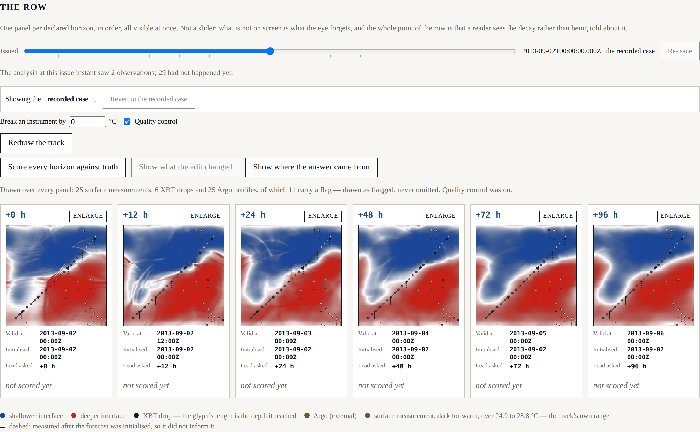
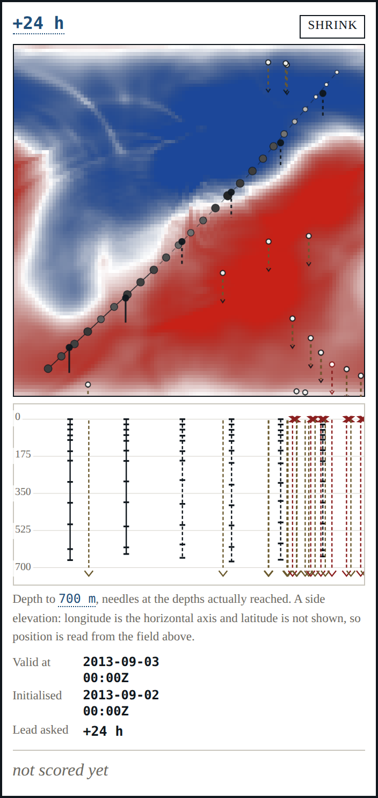
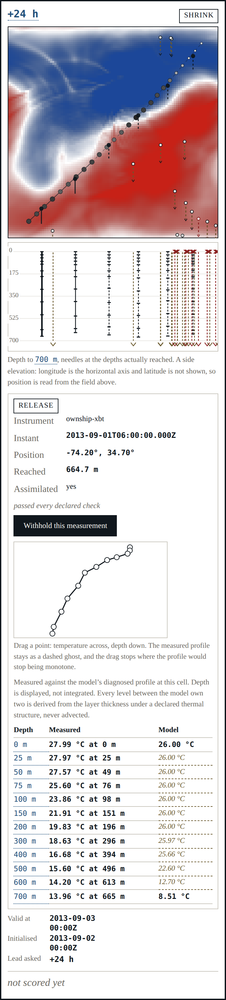

# Beat 008: five profiles that measured nothing, drawn as though they had

The harness has never been allowed to sample truth except through an instrument. This beat
draws what those instruments did: where the vessel went, what it measured on the way, how deep
each probe actually got, and which observations failed a check.

## Drawing the observations found a defect in what we said about them

The recorded case carries twenty-five Argo profiles. **Five of them report a temperature at no
level at all** — every level null, with an Argo quality flag of 4. They are delayed-mode files
from a single float; they have real positions and real instants and no usable measurement.

Beat 004 handled them correctly where it mattered. The *derived* interface-depth observation —
the thing the analysis consumes — is flagged `unresolved`, is not usable, and is excluded from
the analysis and recorded as excluded. No number anywhere was wrong.

But the flag lived on the derived observation, and the thing the footprint draws is the
**profile**, which carried no flag at all. Drawn faithfully, a profile that measured nothing
would have looked exactly like one that measured everything, and its needle would have had zero
extent — which reads as a probe that reached the surface and stopped.

So the flag moved to where the drawing is. Any profile with no usable level now carries
`unresolved` in its own right, the footprint marks it as having measured nothing, and it is
drawn as a cross at the surface rather than a needle of no length.

Nothing about the analysis changed, and that is the point. This was a defect in what the
harness *said*, not in what it computed, and it only became visible when somebody had to draw
it.

## Needles at the depths actually reached

At row width a drop is a glyph whose length is the depth it reached — never an
undifferentiated dot, because a drop flattened to the surface discards the dimension it exists
for. Enlarge a panel and it gains a depth elevation: one needle per profile, extending exactly
as far as that probe got, with a tick at every level it sampled and a barb where a float
carried on past the floor of the displayed volume.

The projection is a **side elevation**, not a scene: it shares the field's horizontal axis and
puts depth downward, so latitude is not shown. That is a real loss and the caption says so — a
perspective volume would have implied a viewpoint and a set of distances the harness does not
have, and would have made a needle's length depend on where the reader was standing rather
than on how deep the probe went.

An XBT infers its depth from a fall-rate equation, so no two of these reach the same depth and
none reaches the depth it was asked for: 665 m for a probe asked for 650, 613 m for one asked
for 600. The needle is drawn to what it reached.

## The derived profile, beside the measurement

Hover — or click, which pins it — and the panel shows the measured profile beside the model's
own diagnosed one, with every level's kind on it.

They disagree, plainly:

| Depth | Measured | Model |
|---|---|---|
| 0 m | 27.99 °C | 26.00 °C *(computed)* |
| 200 m | 19.83 °C at 196 m | 26.00 °C *(derived)* |
| 400 m | 16.68 °C at 394 m | 25.43 °C *(derived)* |
| 600 m | 14.20 °C at 613 m | 11.05 °C *(derived)* |
| 700 m | 13.96 °C at 665 m | 8.30 °C *(computed)* |

The probe's thermocline is near 300 m. The model's is near 590 m.

This is exactly the situation SRD §10 described: *a reader sees the derived profile disagree
with the XBT beside it, and it is a finding rather than a defect, because the surface said the
profile was derived.* That label is on every interpolated level, in its own typographic style,
and it was there before the capability to do better was.

It is **not** the trigger for adopting dynamic depth levels. That trigger is a question about
vertical structure evolving in time; this is a static offset — the interface is in the wrong
*place*, not resolved at the wrong number of levels, and advected vertical structure would not
move it. The cause is the mismatch beat 006 traced between two declared numbers, the reduced
gravity and the thermal structure, which makes the model's interface anomaly about three times
too large about a mean that is already too deep. ADR-0009 now records the observation and says
the deferral stands for a reason that is evidence rather than assumption.

## What was rejected is part of what was done

Eleven of the fifty-six observations in the recorded case carry a flag, and every one is drawn.
A flagged mark is white-filled inside a ring where an unflagged one is filled dark, so the
distinction is a luminance difference and survives a monochrome print. The test measures it on
the rendered pixels: **218.4** of 255, against a declared margin of 40.

Two smaller things worth recording. Every panel now carries a visually hidden **list** of its
marks — one entry per observation, with kind, flag state and position — because a canvas says
nothing to a reader who cannot see it, and nothing to a test either; the counts in the shell
tests are asserted against that list. And measured levels are matched to the model's display
levels **by depth, not by index**: an XBT's declared depths and the model's declared display
levels happen to be nearly the same list, but an Argo profile's five hundred levels are not,
and lining them up by position would have invented a correspondence.

## Where it stands

217 headless tests, 23 shell tests, seven gates. Beat 009 gives the row a second axis: the
shore forecast, and what a forecast is worth when it was issued rather than when it was scored.
