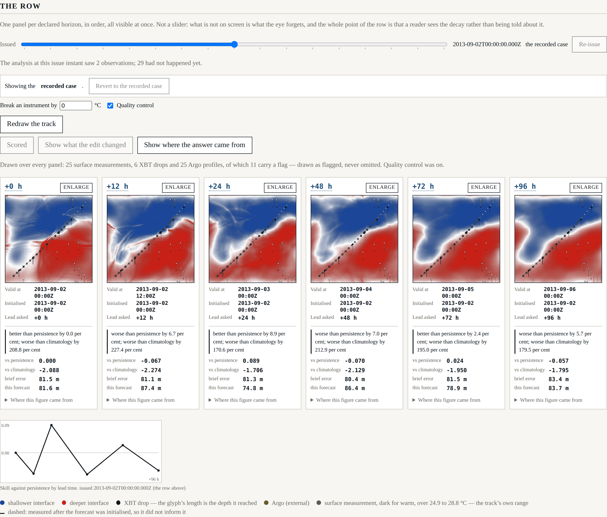
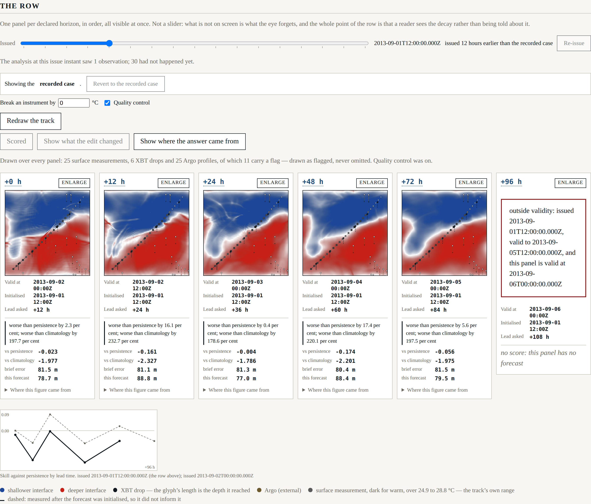
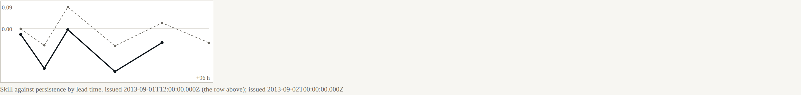

# Beat 009: a forecast that was using measurements it could not have had

This beat was supposed to be about presentation: a second axis, so that staleness and lead
time stop being conflated. It is, and that part works. But adding an issue-time control means
asking what a forecast issued at a given instant is allowed to know, and the answer we had been
giving was wrong.

## The analysis was reading its own future

The recorded case issues its forecast at +24 h. Its XBT drops are at +6, +18, +30, +42, +54 and
+66 h; its Argo profiles are spread across the whole period.

**The analysis at +24 h was being handed all of them.** A forecast made on the second of
September was using a measurement taken on the fourth.

Nothing about this was subtle once the question was asked. It survived three beats because
nothing ever asked it: the analysis consumed "the run's observations", the run produced one set
of them, and the issue instant was a number that fixed where the integration started rather
than a boundary on what could be known.

Fixing it is one line and a comment. The consequences are not one line:

| | Before | After |
|---|---|---|
| Observations the analysis saw | 31 | **2** |
| Skill against persistence at 12 h | 0.133 | **−0.067** |
| Skill against persistence at 24 h | 0.145 | **0.089** |
| Skill against persistence at 96 h | 0.155 | **−0.057** |

The corrected row is roughly *no better than persistence*: positive at two horizons, negative at
three, zero at the first. Beat 006's engineering note now carries a correction pointing here,
because a superseded figure left looking current is worse than no figure.

Two more consequences worth stating:

- **The independence caveat never fires in the recorded case.** No Argo profile has arrived by
  +24 h, so nothing external is assimilated and review R-3's caveat has nothing to attach to.
  Good for independence; useless for testing the caveat, which now lives on a later issue time.
  And a panel with nothing to caveat says so, because a reader cannot tell "independent" from
  "nobody checked" by looking at a blank space.
- **AT-03 got *stronger*.** With only the two drops that had reported, skill within 120 km of a
  drop is **0.377** against **−0.012** outside it. The measurement is worth something, and it is
  worth it locally in a way nothing else in this system is doing for it.

## The two axes

That was the accident. Here is the feature.



The declared horizons are measured from the **default** issue instant, which fixes the six
valid instants the row shows. Move the control back twelve hours and the panels do not move:
each becomes a *longer* forecast of the same moment. Every panel says both — the horizon that
names it, and the lead actually asked of the model.



```
  +0 h  issued at default  0.000   issued 12 h earlier  -0.023
 +12 h  issued at default -0.067   issued 12 h earlier  -0.161
 +24 h  issued at default  0.089   issued 12 h earlier  -0.004
 +48 h  issued at default -0.070   issued 12 h earlier  -0.174
 +72 h  issued at default  0.024   issued 12 h earlier  -0.056
 +96 h  issued at default -0.057   issued 12 h earlier  outside validity
```

Worse at every horizon that can be compared, with nothing else changed. That is what twelve
hours of staleness costs, and it is a different question from what four days of lead time
costs — which is the whole reason the second axis exists.

The SRD asked whether the two axes needed a two-dimensional control. They do not: **the row is
one of the axes**, so there is one scrubber, with the instants at which something was actually
measured marked along it. A small inset draws the curves that have been scored, so the drop is
visible as a shape and not only as twelve numbers.



The last panel, once the forecast is twelve hours older, has fallen outside its declared
validity window. It says so and draws nothing. There is no field to give it that would not be
an extrapolation, and an extrapolation drawn beside five forecasts would read as one.

## The departure brief

Every panel now carries the departure brief's error beside its own: the quay-side analysis,
held constant and never refreshed. Asserted by byte identity across an issue-time move — it is
not re-analysed, and it is not re-integrated.

At the quay side of the recorded case nothing has reported yet, so the brief is the background
blended with climatology. That makes it a *generous* baseline rather than a straw man, and the
surface says so. It is also uncomfortably competitive:

```
  +0 h  brief 81.5 m   shore forecast 81.6 m
 +24 h  brief 81.3 m   shore forecast 74.8 m
 +48 h  brief 80.4 m   shore forecast 86.4 m
 +96 h  brief 83.4 m   shore forecast 83.7 m
```

A frozen field from the quay side is within a few metres of the shore forecast at every lead
time and beats it at two of them. The test prints both figures and asserts neither wins,
because which of them wins is a measurement.

## What this beat is really about

Three beats of numbers were optimistic because nobody had asked what the forecast was allowed
to know. The harness did not hide it — there was nothing to hide, only a question nobody had
put — and the moment the question was put, the machinery for reporting the answer was already
there: the figures are printed by tests, the caveats are attached to the figures, and the note
that was wrong now says it was wrong.

That is the whole argument for building it this way.

## Where it stands

227 headless tests, 26 shell tests, seven gates. Beat 010 next: the counterfactuals, where a
reader gets to withhold the measurement and watch what it was worth.
