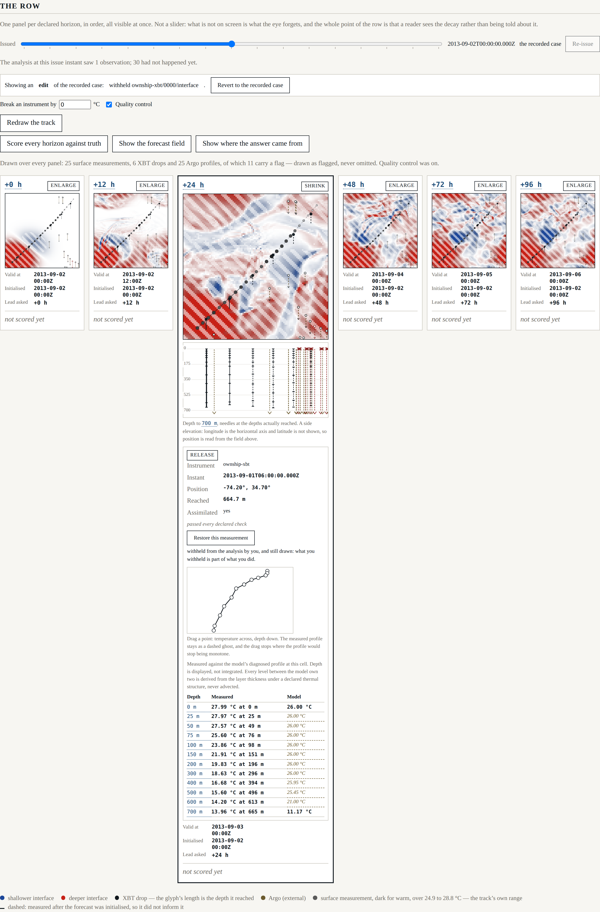
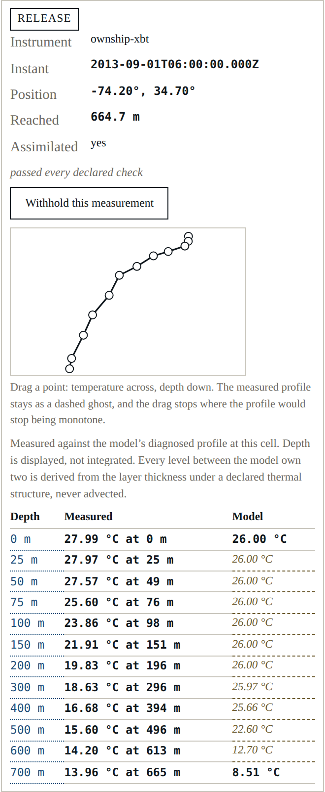
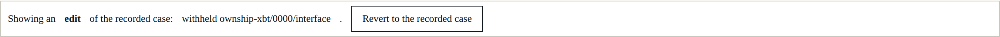

# Beat 010: the quality control that was not excluding anything

This is the beat the harness was for. A reader can now withhold a measurement and read what it
was worth, drag a measured profile and watch the consequence at every horizon, break an
instrument and see whether it is caught, redraw the track and ask whether that was a better
place to have sailed — and undo all of it in one action.



Every edit is a **value applied to a fresh run**, not a mutation of one. That is why "revert
produces byte-identical results" is a property of the design rather than a promise about undo,
and it is why the edits split the way they do: a bias, the quality-control toggle and a redrawn
track are edits to the *declared configuration*, applied before anything is sampled; withholding
and profile-dragging are edits to *what was measured*, applied after. Both halves end up in the
manifest, in order, so an edited run replays.

## Building the control that exercises quality control showed it was doing nothing

The declared checks flag **levels**. The analysis consumes an **interface depth** derived from a
profile. Until this beat, the flags stopped at the levels.

Here is a nine-degree bias on the XBT — enough for the gross-range check to catch its warm
levels:

| | interface depth the analysis assimilated | its error bar |
|---|---|---|
| Unedited | 406.9 m | 0.8 m |
| Biased, **quality control on** | 691.3 m | 2.4 m |
| Biased, quality control off | 691.3 m | 2.4 m |

Three of twelve levels failed. The operator skipped them. The remaining biased levels produced
an interface depth **285 m wrong**, with a two-metre error bar, and the analysis believed it —
with the checks running. Quality control changed what the surface said and nothing at all about
what was computed.

The fix is small and declared: a profile more than a declared fraction of whose levels failed a
check is not trusted at any depth, and the interface derived from it carries the failing check's
flag so the analysis excludes it. (`outside-record` does not count towards that fraction: it
says the truth *record* stopped, not that the instrument lied, and every XBT that overshoots the
record carries one.)

## And a gross bias is caught by the arithmetic, not by the check

Turn the bias up to forty degrees and something quieter happens. Every level is now far outside
the two-layer thermal structure, so the profile never crosses the thermocline, so the operator
returns a *bound* rather than a depth and the observation is flagged `unresolved` — **whether or
not quality control is running**. The two runs are byte-identical, and a test asserts that they
are.

So for a warm bias, the gross-range check can never be the thing that catches it: any bias large
enough to trip the check is also large enough for the operator to refuse the profile, and the
operator gets there first. The error propagation does the work, because a level that constrains
nothing acquires an enormous depth error through the arithmetic rather than through a rule
somebody remembered to write.

Quality control's value here is in what it *says*, not in what it excludes. That is worth
knowing and it is not what anybody assumed.

## What one measurement was worth

```
withholding ownship-xbt/0000/interface at +24 h:
  inside  0.093 -> 0.021
  outside -0.019 -> -0.039
```

Withholding one XBT costs three quarters of the skill within 120 km of where it was dropped, and
moves the rest of the domain by two hundredths. That is AT-03, and it is the clearest result
this project has: not "observations help" but *this observation was worth this much, here*.

## Dragging a profile, with the measurement kept

Select an XBT and drag a point: temperature across, depth down. The measured profile stays drawn
behind the edit as a dashed ghost, because the reader is stating what the instrument *would* have
read, not erasing what it did read — and a picture that forgot the measurement would make the
difference field meaningless. The drag is constrained to keep the profile monotone, and it stops
rather than reordering.



AT-06 expects that edit to be visible at 24 hours and negligible at 96. Measured:

```
an edited profile moves the influence region by 33.05 m at +24 h and 29.65 m at +96 h (90%)
anywhere in the domain:                        33.05 m           and 32.29 m           (98%)
```

The first half holds. The second does not: the anomaly is **advected, not dissipated**, and four
days is not long enough for this model to forget it. The test prints both readings and says the
decline is absent — the same posture beat 006 took with AT-02, for the same reason.

## Small things worth recording

- **The edit is applied when the pointer is released.** Each application reruns the analysis and
  re-integrates six horizons — about a second and a half. Doing that per mouse-move would make
  the drag the slowest thing in the harness.
- **The difference is against a run at the same issue instant**, recomputed rather than
  remembered, so a difference field shows the edit and not the edit plus twelve hours of
  staleness.
- **The vessel-speed rule stretches rather than refuses.** A reader dragging a waypoint is asking
  "what if we had gone there", not "could we have got there by Tuesday". The stretch is stated.
- **Withheld marks are struck through, not removed**, and a recomputation no longer collapses an
  enlarged panel — that one was the converse of the mistake FR-014 forbids, and it had been
  doing it since beat 007.



## Where it stands

237 headless tests, 30 shell tests, seven gates. Beat 011 next: manifest replay, where an edited
run has to come back byte for byte from the file that describes it.
