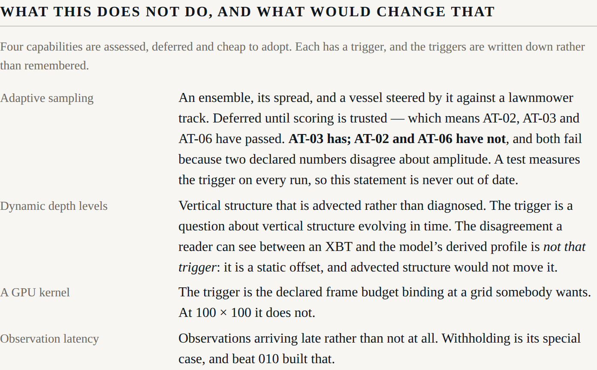

# Beat 012: the beat that reports it should not be built yet

The last feature in the plan is adaptive sampling: perturb the observations within their
declared error, integrate an ensemble, steer the vessel toward where the members disagree, and
race that against a lawnmower track.

It was deferred from the start, behind a trigger somebody wrote down:

> once scoring and the counterfactuals are landed and trusted, since the paired experiment is
> worthless without a skill score anyone believes. "Trusted" means AT-02, AT-03 and AT-06 have
> passed and been watched in the shell.

So the work of this beat was to find out whether that had happened. It has not.

## Measured, not judged

| | State | Measured |
|---|---|---|
| **AT-02** — skill declines across the row | not met | 0.000, −0.067, 0.089, −0.070, 0.024, −0.057. Positive at 24 h, as the central claim requires; the decline is absent. |
| **AT-03** — one measurement is worth something, locally | **met** | withholding one XBT takes local skill from 0.093 to 0.021 within 120 km of it, and moves the rest of the domain by two hundredths. |
| **AT-06** — an edit propagates near and fades far | not met | the edit moves the near horizon by 33.05 m and the far one by 32.29 m: 98 per cent of it. |

Two of the three fail for the **same** reason, and it is not a defect in any code. The declared
reduced gravity and the declared thermal structure disagree about amplitude: the model's
interface anomaly is roughly three times the thermocline displacement the truth record carries,
about a mean that is too deep. Beat 006 found it in the scores, beat 008 showed it as two
profiles side by side, and beat 009 removed the future observations that had been flattering the
figures.

## Why building it anyway would have been worse

The paired experiment's entire content is *which track scored better*. Steering by a sensitivity
field and then scoring the result with a skill score that is roughly zero, from a model that is
worse than climatology at every horizon, produces a number with a winner in it and no
information.

ADR-0011 called that an advertisement before any of this was measured. The measurement has not
changed the argument; it has only made it checkable.

## A trigger that is measured on every run

The obvious failure mode for a deferral is that it becomes a decision nobody revisits. So the
trigger is a test. It measures all three acceptance tests, asserts the state each is *actually*
in, and prints the verdict in one place.

Which means it **fails when the figures improve** — and its assertion messages say so:

```
if this is now true, AT-02 may be met: see ADR-0011 and plan beat 012
```

The day that test goes red is the day to plan the beat, not the day to relax the test.

## And the deferrals go on the surface

All four of them, each with its trigger, where a reader meets the run:



Two of those entries say something more specific than "not yet". Dynamic depth levels are
deferred behind a question about vertical structure *evolving in time* — and beat 008's visible
disagreement between an XBT and the model's derived profile is explicitly **not** that trigger,
because it is a static offset that advected structure would not move. A GPU kernel is deferred
behind the frame budget binding, and at 100 × 100 it does not.

Leaving those off the page would make the harness look more capable than it is, which is the
failure mode this project has spent most of its effort avoiding.

## Twelve beats

Every beat found something. In order: an ADR whose stability arithmetic was wrong twice; a
truth record with two nine-hour gaps that had to be declared rather than smoothed; a leapfrog
scheme unconditionally unstable for diffusion; a quality-control tolerance below the instrument
noise it was checking; a single observation carrying 202 per cent of the weight in its own cell;
a model worse than climatology by 250 per cent; a row that passed its tests while showing four
and a half of six panels; five Argo profiles that measured nothing and were drawn as though they
had; an analysis reading observations from its own future; quality control that had never
excluded anything; and an analysis that meant two different things depending on when it was
computed.

None of those was found by inspection. Each was found because something in the tree measures
what it claims and prints the figure beside the claim.

The last one is this: the last feature should not be built yet, and here is the number that says
so.

**Seven questions remain for the author**, in
[`docs/questions-for-the-author.md`](https://github.com/DeepBlueCLtd/j-ocean/blob/main/docs/questions-for-the-author.md).
The first of them, settled, would change most of the rest.
