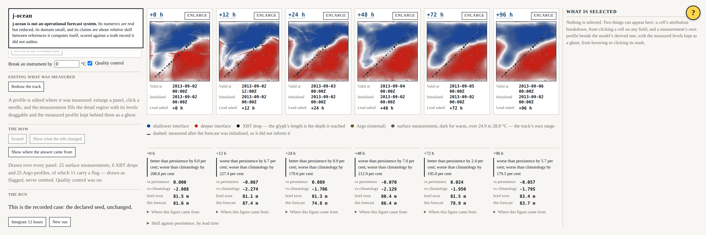

# Beat 013: the page that could not be followed

Version 1 shipped as a long scrolling page: introductory matter, blog, and the application
beneath it. Every test passed. At the declared reference width it was **5,757 pixels tall** —
six and a half vertical screens — and a reader who dragged a control watched nothing happen,
because what changed was two screens away.

That is not a complaint about styling. Beat 007 chose a row of six panels over a slider on the
explicit ground that *a reader cannot hold an unseen frame in memory*. A page that scrolls
reintroduces exactly that fault one level up: the six panels are side by side, and the control
that drives them is somewhere else entirely.

## The expensive part came first

This beat moves things and computes nothing new. That is a comfortable claim to make about a
1,301-line component whose presentation and computation had never been separated, and an
impossible one to check by reading a diff.

So before a single element moved, gate **G-07** landed. It walks the recorded case from the
declared seed and digests **forty-one quantities** — the configuration, the initialisation, the
state bytes before and after the declared advance, the five published fields, all three
instruments, the analysis field with its attribution weights and its used and excluded sets, each
of the six horizons' forecast fields, the departure brief, every score, and the two footprints the
surface reads. Each digest carries the sentence naming what produced it, because a digest is a
figure and Principle V does not exempt figures that happen to be hexadecimal.

It was watched failing on a planted violation before it was trusted: one analysis coefficient
changed in a declared configuration, and seventeen of the forty-one moved.

Then the refactor proceeded under it. Across a rewrite of three components, **forty of the
forty-one digests are byte-identical from the first commit to the last.** One moved:
`configuration`, because this beat declared four new presentation figures and the digest is of the
whole validated configuration. It was re-recorded once, with both digests in the commit message.

## Four regions, divided by what changes when

Not by subject — that is what version 1 divided by, and subjects have no natural bound, which is
how there came to be ten of them. By **rate of change**: causes on the left, the payload in the
centre, consequences directly beneath their own panels, and the thing being inspected on the
right.

The scores are the part worth dwelling on. They are not a table. Each panel's skill figures sit in
that panel's own grid column, and they sit there *structurally* — the centre and the scores are
both `subgrid` of the same tracks, so a score is under its panel because the browser put it in the
same column, not because someone lined them up. Six figures read left to right draw the decay for
free. The old scores table is deleted rather than hidden: a table asks a reader to match a row
label against a panel heading at every glance, and that is a small tax paid every time.

An empty region says what would appear in it. Before anything is selected, the detail region names
the two things that can fill it and how to put one there.

## What the move found

A refactor that is forbidden to change any number is unusually good at finding things, because
everything it cannot fix has to be written down.

**The drawn anomaly is not the scored anomaly.** Every panel draws its field as an anomaly about
the mean of every finite cell of the grid. The scorer removes the mean over the domain *less its
six-cell sponge margin* — 10,000 cells against 7,744. The comment above the drawing loop calls it
"an anomaly about its own regional mean" and justifies the transform on the ground that a picture
and a number must not describe different things. The comment says regional; the loop says global.
The justification written above the code is the argument against what the code does.

**One of the two declared domains cannot be run.** SRD-v1 FR-11 declares an eventful Gulf Stream
front and a deliberately bland open gyre, so a reader can see what the harness says when there is
nothing to see. Nothing on the surface had ever offered the second one, so in twelve beats nobody
had tried. Building the picker was the first attempt, and it fails: the vessel's track waypoints
are declared once, in the eventful domain's longitudes, and the thermometer refuses at −74.5°
because the track leaves the water it is sampling. The surface now prints the instrument's refusal
in its own words beside the choice and leaves the standing run alone. A legible refusal is not a
domain a reader can look at, and a track declared per domain is the author's call.

**The reference width had quietly stopped describing a usable layout.** 1,400 px was declared in
beat 007, when the row had the whole window. Six panels at their declared minimum need 1,190, and
the two columns plus the gutter need 848 more.

## The floor, and the honest consequence

A no-scroll requirement without a smallest-case answer is an unfinished requirement. So the
smallest viewport the four regions hold is **measured** from the built layout rather than chosen:
**2,038 × 682 CSS pixels**, and it is tight — a panel is *at* its declared 190 px and the centre
has no spare height, so one pixel less is one pixel too few.

The width is a sum of declared boxes. The height could not have been predicted, because a score
statement is a sentence that wraps in its own column: a wider panel is a shorter score, so the
height had to be taken at the floor's own width and not at a roomy one.

The consequence is not comfortable and is not softened. **A 13-inch laptop is below the floor.**
Most readers will meet the answer above rather than the row: the size the application needs, drawn
as a declared figure, and one horizon at a time with the strip carrying all six and what each was
worth — because comparison across horizons is the lesson, and an enlargement that hid the other
five would trade the lesson for the detail. Widening the window past the figure brings the full
row back without a reload.

The alternative was six panels too narrow to read, or a row that scrolls. The second of those is
the fault beat 007 caught, arriving through a different door.

## Measured

Five thousand seven hundred and fifty-seven pixels to nine hundred. No page scroll on either axis
in any of the seven states the application can reach. Four regions that declare when they scroll
within themselves — and a fifth that did not, found by the test: every field's accessible mark list
was absolutely positioned inside an unpositioned `figure`, so its containing block was the
viewport, and it escaped every scroll container to lengthen the page by 33 px.

256 headless tests, 54 shell tests, eight gates, and eleven questions now open for the author.
