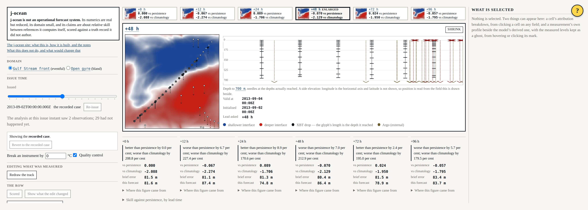
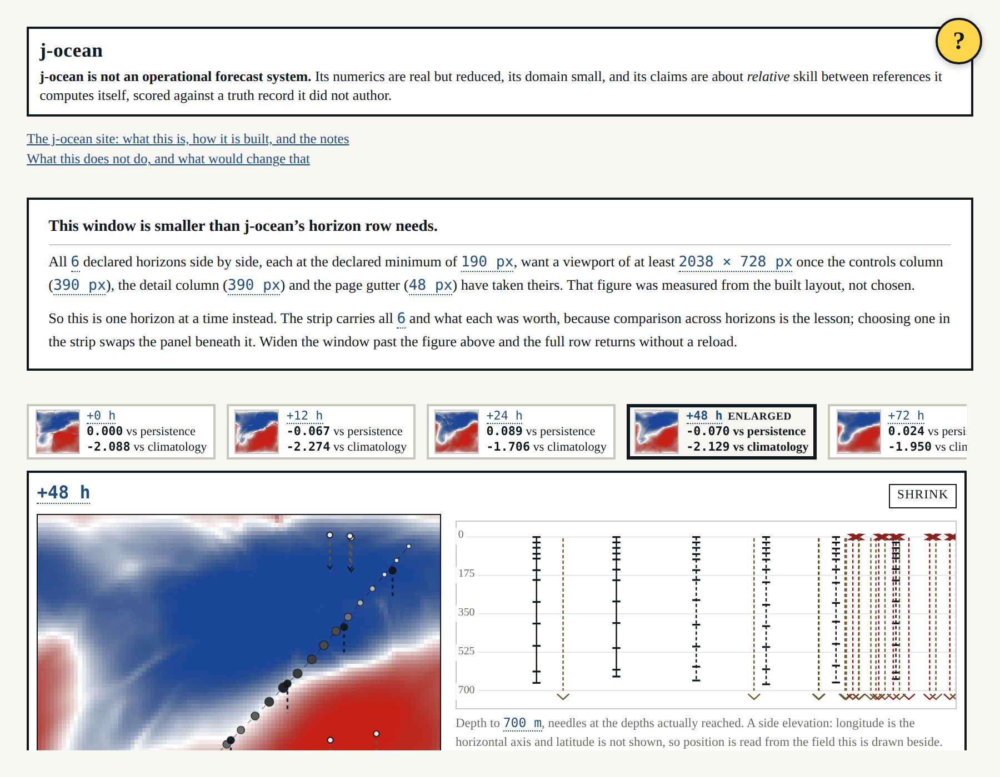
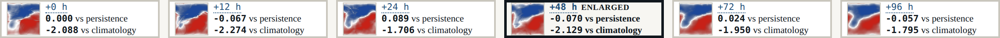

# Beat 015: enlargement is a selection, not a mode

Beat 007 chose a row of six panels over a slider, and it chose it for one reason: **comparison
across horizons is the lesson.** Skill decays with lead time, and a reader should judge that
rather than be told it, which they cannot do one frame at a time. So an enlargement that hides
the other five trades the lesson for the detail — it is a slider with extra steps, arriving
through a different door.

This beat makes enlargement a selection like any other. It changes what the centre region
contains and nothing else on the surface. The row survives above the enlarged panel as a
**strip**, carrying every declared horizon and what each was worth, and choosing another
horizon in the strip swaps the centre directly.



## The strip already existed, which is the whole shape of this beat

Beat 013 measured the smallest window the four regions hold and had to answer for windows
below it. Its answer was one horizon at a time with a strip above it carrying all six — because
a no-scroll requirement without a smallest-case answer is an unfinished requirement.

That is this beat's requirement, built early. So the work here was not *build a strip*. It was
to make the strip **the one way the centre holds a single panel**, at any viewport, and delete
the second implementation. There is one `HorizonStrip`, one enlarged panel, one set of
keyboard behaviour, one marking. Below the floor the presentation is not a parallel
arrangement of the same idea any more; it is the same union, forced:

```ts
export type CentreContent =
  | { readonly kind: 'row' }
  | { readonly kind: 'enlarged'; readonly leadHours: number };
```

*Never both, never neither* is then a property of the type rather than a rule somebody has to
remember. The below-floor fallback selects an enlargement; it does not lay out a panel of its
own. Two things that draw a strip are two things that drift, and this beat exists because they
would have.



## The part that was harder than it looked: nothing else may move

The requirement is that the controls, the scores and the detail region keep their rectangles
**to the pixel** while the centre's contents are replaced. The scores region sits directly
beneath the centre, so that is a claim about the centre's *height*: a centre sized by what is
in it is one height with six small panels in it and another with one large one, and the scores
move on a click.

So the centre's height is now declared rather than fitted. It is the row's own arithmetic —
one panel's field is a square at the track width, so the centre is one track wide plus what it
costs beyond the field: the panel's header and labels, the legend, and the strip that an
enlargement puts above the panel.

```css
--track-width: calc((var(--centre-width) - 5 * var(--panel-gap)) / 6);
--centre-height: calc(var(--track-width) + var(--centre-chrome-height) + var(--strip-height));
```

`centreChromeHeightPx` and `strip.heightPx` are declared in configuration and measured from
the built layout, exactly as beat 013 measured the floor. A browser test holds them: the
centre's rectangle must be identical with the row in it and with an enlarged panel in it, and
the centre's content must fit its box with nothing to spare, in all three of the things the
centre can hold.

**The floor moved with it, and that is the honest cost.** The declared minimum viewport was
2038 × 682; it is now 2038 × 728. The extra 46 pixels are the strip's height, which the centre
reserves in both states so that the box does not change. The row therefore sits in a centre
slightly taller than it needs, and that is the price of the scores never moving.

**One thing was given up, and it is worth naming.** The depth elevation of beat 008 used to sit
directly beneath the enlarged field, sharing its horizontal axis. Inside a box the centre
keeps, a field worth enlarging and a 170-pixel elevation do not both fit vertically at the
declared floor. The elevation is now beside the field rather than beneath it. The longitude
range is the same range, so the axis is shared in scale if no longer in position, and the
caption says which axis is which. The field, in exchange, is drawn at 328 px against the row's
174.

## No unenlarged frame in between

"Selecting another panel swaps the centre directly" is a claim about what was *rendered*, and
the obvious way to check it — click, and see how long an intermediate state lasted — is a test
that measures the machine. It passes on a fast one and fails on a slow one.

So the centre keeps a ledger. Every commit writes its content kind into an attribute, and a
swap reads:

```
row enlarged(48) enlarged(96)
```

A swap that closed the enlargement on the way would read `enlarged(48) row enlarged(96)`, and
the test says so by name. The same ledger holds the first edge case: a reissue while enlarged
puts new forecasts under the same horizon and the centre never goes back to the row.

## Identity, and a finding about how it used to be asserted

Beat 007's requirement is that enlarging changes what is shown and never what is computed, and
its own words are that the assertion is **by identity** — the same `Float64Array` object in the
panel before and after.

It was not. The browser test compared the canvas's rendering backend, which is a weaker thing
that happened to hold. The reason is real rather than careless: an object cannot be got out of
a browser, because `page.evaluate` returns a structured clone, and a clone of a copy is
indistinguishable from a clone of the original.

The fix is to compare inside the page. Each canvas now carries the array it drew, and the test
asks `===` there — across an enlargement, and across a strip swap, and between a panel and the
strip thumbnail of the same horizon. Deep equality would have been satisfied by a recomputed
copy, which is precisely the failure the requirement exists to forbid.

The thumbnails are the same arrays for the same reason. Each slot draws the field object its
panel draws, into a canvas of the grid's own size shown small by CSS. A reduction computed for
a thumbnail would be display causing computation, which is the entanglement the invariance
gate spent a beat on. And enlarging does not score anything: scoring costs about a second and
happens when it is asked for, so the strip says *not scored yet* in the same words the scores
region uses.

## Marked without colour, operable without a mouse



The marking is a border weight, a darker border and the word *enlarged* — never a hue. It is
held to a measured margin the way the attribution layer is: the strip is photographed, the PNG
is decoded, and the marked slot's border is compared with an unmarked one's in luminance. The
measurement is **176 of 255**, against a bar of 40. A marking read off the stylesheet would be
a measurement of the stylesheet; a monochrome print is made of pixels.

The strip is a roving-tabindex toolbar: one slot is in the tab order, the arrows move along it
without choosing anything, and Enter or Space swaps the centre with focus staying where it
was. Six tab stops would have put five keystrokes between the surface and the next region.

## What did not move

Forty of G-07's forty-one digests are byte-identical. The one that moved is `configuration`,
because this beat declares three new presentation figures and raises the declared viewport
floor, and the digest is of the whole validated configuration. Nothing computed changed, which
is what a beat about display should be able to say.

273 headless tests, 69 in a browser, eight gates, screenshots recaptured.
