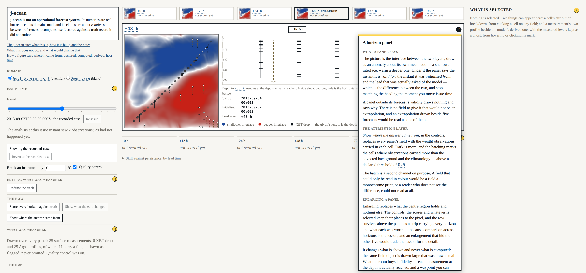
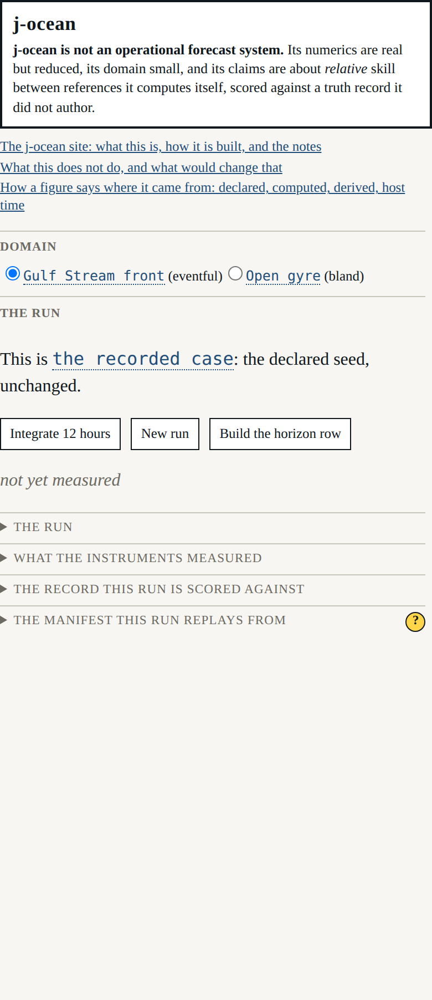
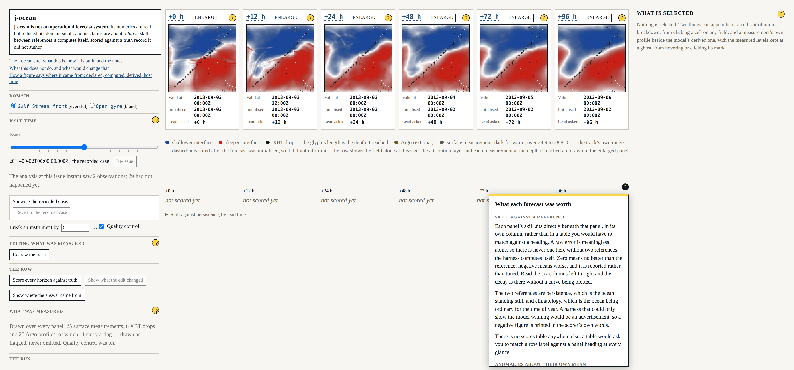

# Beat 016: help where the reader asks for it, and the walkthrough retires

The walkthrough was the right instinct at the wrong altitude.

It was built to answer the question every panel on this page leaves open: not *what is this
figure*, which each panel already says, but *why is this panel next to that one*. That is a
real question and it deserved an answer. What it got was a tour: eleven steps, in a fixed
order, beginning wherever it began. A reader confused by attribution had to walk three panels
to reach the sentence they wanted, and a reader who wanted none of it had a bright yellow
button in the corner of the window telling them they were missing something.

It was also a **second place where the surface is described**. Every step pointed at a
`data-testid` and the tour dropped a step whose anchor had gone, so a renamed panel shortened
it rather than breaking it. The anchors were checked; the *content* was not. A panel could
gain a layer, keep its test id, and the step describing it would go on describing the panel it
used to be.

This beat inverts it. The explanation lives with the thing it explains, opens where the reader
is already looking, closes again, and is held to a declaration on disk.



## The absence is the requirement

The easiest way to build panel help is to put a control on every panel and fill the thin ones
with a sentence. That is precisely what FR-053 forbids, and the reason is worth saying: a
reader who presses a help control and finds a stub has learned that the control is not worth
pressing, and they will not press the next one either — including the one that would have
told them what they needed.

So a panel with nothing to explain renders **nothing at all**. Not a disabled control, not a
placeholder, not a tooltip saying help is coming. Four of the fifteen declared panels are like
that, and each says in the declaration *why*:

```json
{
  "id": "controls/row-display",
  "region": "controls",
  "heading": "The row",
  "features": [],
  "nothingToExplain": "Three buttons that each say on their own face what they will do, and what they do is drawn on the six panels the moment they are pressed. What the drawing means is the legend's business, beneath the row."
}
```

That field is not decoration. "Nobody has written it yet" and "there is nothing to write" look
identical from the surface, and only one of them is a finished panel. The gate requires the
sentence, so the difference is on disk.



## One list of panels, not two

The plan's hardest constraint was that a panel's declaration must be the **same** declaration
the layout draws from. A separate list of "panels that have help" would be exactly the
staleness this beat exists to prevent, reintroduced by the fix for it.

It is one list, and the mechanism is that **a panel is drawn by naming its declaration**:

```tsx
<PanelHead panel="controls/manifest" />
```

`PanelHead` reads the heading out of the declaration, so the words at the head of a panel and
the words in the list are one fact rather than two facts that agree today. The regions are the
same story: `REGIONS` lives beside the panel list, `Regions.tsx` lays the surface out from it,
every declaration names one of those regions, and the disposition record's own list of regions
is asserted equal to it.

Gate **G-08** then holds the pairing in both directions, and adds the clause that stops it
being satisfied by declaring nothing:

- every region or layer a panel declares has an explanation;
- every explanation names a panel and a feature that are declared;
- **every panel the layout draws is declared, and every declaration is drawn.**

## G-08, watched failing on four plants

A check that has never been seen to fail is worth nothing. Four fixtures, each a tree laid out
like this one, each run through the gate as the program CI runs:

```text
FAIL  G-08 help coverage  (8 files scanned)
      src/harness/help/centre-attribution.tsx:1  panel "centre/attribution" declares the
      feature "the hatched channel" and nothing explains it

FAIL  G-08 help coverage  (9 files scanned)
      src/harness/help/centre-horizon-row.tsx:1  this help entry names the panel
      "centre/horizon-row", which is not declared in src/harness/panels.json: an explanation
      of something nobody can see

FAIL  G-08 help coverage  (8 files scanned)
      src/harness/help/centre-attribution.tsx:7  the explanation of "the influence radius" on
      panel "centre/attribution" is empty (4 letters); FR-053 prefers no control at all to a stub

FAIL  G-08 help coverage  (8 files scanned)
      src/harness/Planted.tsx:8  the layout draws a panel "centre/horizon-panel" that
      src/harness/panels.json does not declare
```

The orphan — the second of those — is the failure that actually happens. Deleting a panel is
something somebody does deliberately; deleting the paragraph that described it is something
they forget, and the paragraph then survives, describing something nobody can see.

A fifth case is the clean fixture, which declares no panels at all. It **fails**, and it has
to: every pairing check above is satisfied by an empty list, so the absence of the list is the
failure rather than a skip.

## Help teaches; it may not report

FR-055 is the rule that a help panel may not state a live figure or any component's current
state. The reason is not tidiness. A help panel that reported would be a **second source** for
a fact the surface already shows, and the copy is always the one that goes stale.

The rule is a test over the sources rather than a habit at review. It rejects three things: any
reach for run state, any provenance-typed figure that is not `Declared`, and any digit that is
not read from configuration. That last one is Principle X applied to prose — a number a help
entry teaches with is read from the file that declares it, because a restated number is the
same second source in a smaller disguise.

It was watched failing on an entry planted in a real help module, quoting a live skill score
the way somebody would actually write it if they were not thinking about FR-055:

```text
src/harness/help/scores.tsx:1  draws a computed figure; only a declared figure may appear in help
src/harness/help/scores.tsx:26 states the run: help teaches, it does not report
src/harness/help/scores.tsx:26 states a score: help teaches, it does not report
src/harness/help/scores.tsx:26 states a formatted quantity: help teaches, it does not report
src/harness/help/scores.tsx:26 draws a computed figure; only a declared figure may appear in help
src/harness/help/scores.tsx:26 states a numeral that is not read from configuration;
                               a figure a help entry teaches with is a declared one
src/harness/help/scores.tsx:27 states a numeral that is not read from configuration; ...
```

The structural half of the same rule is that a help body takes the validated configuration and
**nothing else** — there is no run, no forecast and no score in scope to reach for. The test
catches the attempt before the type error does, and names the file.

## Placed, not laid out

Opening help may not change any region's bounding rectangle. That is SC-005, and it is the
same requirement as FR-049's: a surface that shifted by two pixels on a click teaches the same
caution as one that reflowed.

So the explanation is `position: fixed`, anchored to the control that opened it, and the
placement is chosen from the **space** around the control rather than from the card's own
height — space is known before the card renders, and placing from last render's height leaves
it hanging off the window for a frame. It is capped to the room there is, scrolls within
itself, and declares that it does with `data-scrolls` like every other scroller here. At the
declared floor, a horizon panel's help is 658 px tall in a 728 px window and scrolls; the page
does not.

The scores region got the interesting version of the problem. It has no heading line — each
column is headed by the panel above it — and adding one would have changed the region's
height, which is the one thing AT-13 says a click may not do. Its control is placed in the
region's corner, out of the flow.



## Help belongs to a panel instance, and dies with it

Enlarging a panel unmounts it from the row and mounts it in the enlarged centre. Choosing a
different horizon in the strip puts a *different* panel there. The help should follow the first
and close on the second, and those are the same mechanism seen twice: each panel registers its
key while it is mounted, and the provider closes any help whose key is no longer registered.
Enlarging re-registers the same key in the same commit and the explanation survives; a strip
swap does not, and it does not.

## Where the eleven steps went

The plan settled that the tour's steps are placed through beat 014's record rather than a
second one, with `dropped` and a reason as a permitted destination. Seventeen pieces of matter
across the eleven steps: **seven** to a panel's help, **seven** to the site, **three** dropped
with a reason written down.

The record now *resolves* a help destination rather than reporting it owed. `failuresOf`
renders the entry and looks for the words, so a panel whose explanation is edited away fails
the build with the paragraph named. That includes the eight beat 014 sent forward — which is
the point of having written that test two beats early:

```text
8 explanations beat 014 owed are built in beat 016-panel-help:
help:controls/editing-what-was-measured, help:controls/editing-what-was-measured,
help:controls/manifest, help:centre/horizon-row, help:centre/attribution,
help:scores, help:scores, help:detail/attribution-breakdown
```

The three drops each carry a reason, and one is worth quoting because it is the beat's own
argument turned on the tour: *"Building the row integrates four days forward, so it happens
when you ask"* is dropped because the same fact is already in `help:centre/horizon-row`, in
beat 014's own longer sentence. Two sentences for one fact is exactly the duplication this
beat removes.

The legend of the four figure kinds went to the site rather than to a panel, because it
explains the whole surface and not one panel — and the application links to it from the head
of its controls column, which is what makes it *placed* rather than *moved away*.

## What it cost, and what did not move

The floor was re-measured rather than assumed, because this beat adds a control to a panel
190 px wide: **2038 × 728 CSS px**, unchanged. No declared figure moved, so G-07 is green with
`scripts/gates/records/surface-invariance.json` untouched — all 41 digests byte-identical. No
FR-40 finding.

Two things were added to the constitution's schedule rather than only to `run-all.ts`: G-08,
and **G-07**, which landed in beat 013 and had been running in CI unlisted ever since. The
late arrival is recorded as a finding in ADR-0013 rather than backdated. A gate that runs
without being listed is one whose disappearance nobody would notice.

297 headless tests, 74 in a browser, **nine gates**, screenshots recaptured.
