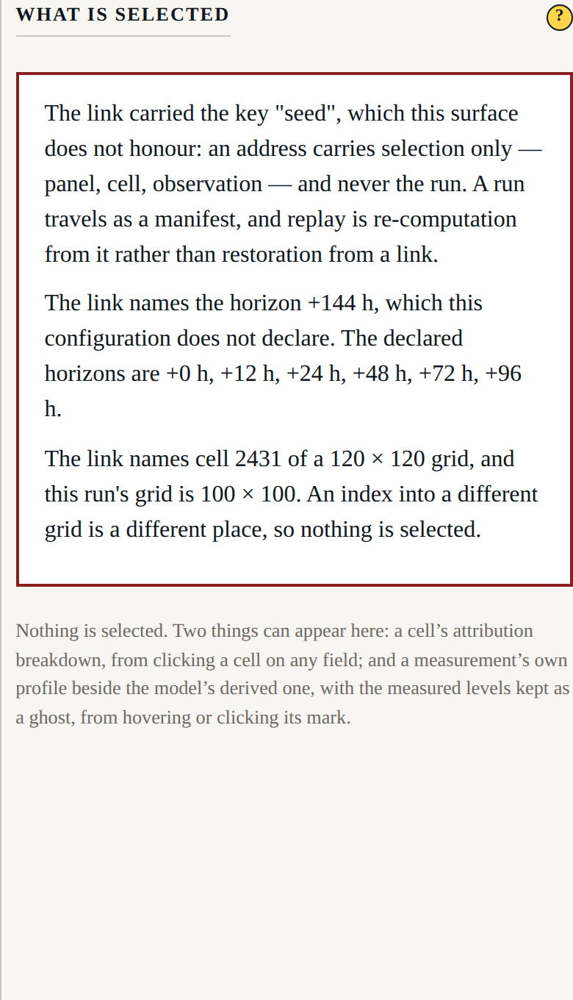
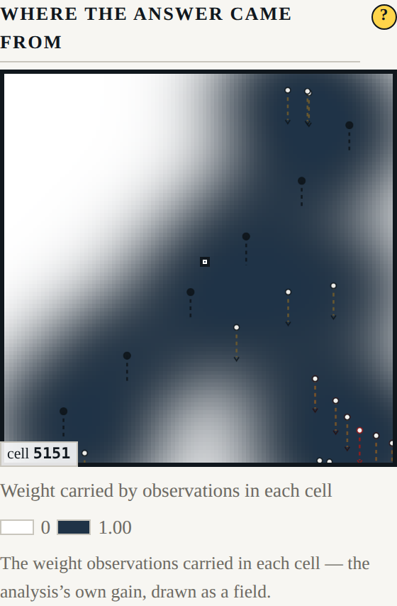

# Beat 017: a link points at a thing, and never at a run

Two people discussing a forecast need to point at the same thing. Until this beat they could
not: every selection was in memory, and a link opened the application on whatever it opened
on. So the selected panel, the selected cell and the selected observation are now in the
address, and a link opens on the thing being discussed.

That is the easy half, and it is not the half this beat is about.

## The sharp edge

Addressability is one small step from a second persistence mechanism, and this repository
already has one. A run is a seed and a manifest, and replay is **re-computation from a
manifest** rather than restoration from a link. A URL carrying a seed would be a second way to
bring a run back with none of the manifest's checks: no code version, no configuration digest,
and no refusal when the tree has moved. It would be persistence arriving through the door
marked convenience, and it would look like a feature the whole way in.

So the address is a **grammar of three keys and no others**:

```text
?panel=48&cell=2431@100x100&observation=ownship-thermometer/0003
```

A link therefore means *“look at cell 2431 of the +48 h panel”*, and what a reader sees there
depends on the run they are in. That is the honest meaning of it, and the surface says so
rather than implying a link restores anything.

## The grammar, watched failing on a planted `seed=`

`ADDRESS_KEYS` is the whole of it, `parseAddress` and `serialiseAddress` are the two directions
of one fact, and `tests/harness/address.test.ts` rejects any addition. The rejection is in two
places because they fail on different mistakes: the **vocabulary** check fails when somebody
widens the key list, which is how a run key would actually arrive — as an obvious convenience,
in a small diff — and the **round trip** fails when something reachable serialises a key the
grammar does not admit.

It was watched failing on a `seed` planted in `ADDRESS_KEYS` and honoured by the parser, the
way somebody would write it if they were not thinking about Principle I. Four tests fail:

```text
× the address grammar > admits exactly panel, cell and observation
  → the address grammar has changed. It carries selection only: a fourth key is a second
    persistence mechanism with none of the manifest's checks (Principle I).
    expected [ Array(4) ] to deeply equal [ 'panel', 'cell', 'observation' ]

× the address grammar > admits no key that names a run rather than a selection
  → the address grammar carries seed, which names the run rather than a selection. A run is a
    seed and a manifest, and replay is re-computation from the manifest: an address that
    carried one would be a second way to bring a run back, with no code version, no
    configuration digest, and no refusal when the tree has moved (constitution Principle I,
    SRD-v1 "no run in the URL").
    expected [ 'seed' ] to deeply equal []

× the address grammar > serialises no key outside the grammar, with everything selected
  → the address wrote a key the grammar does not admit:
    ?panel=48&cell=2431@100x100&observation=ownship-thermometer/0003

× the address grammar > ignores an unknown key and says the link carried something it does
  not honour
  → expected [] to have a length of 1 but got +0
```

The second of those is the one worth having. The first says a list changed; the second says
**why the change is refused**, which is what somebody reading a failed build at speed needs.
The fourth is the plant's own consequence: a grammar that honours `seed` no longer reports it.

A link that carries a key anyway is ignored **and reported**. Both halves matter. Obeying it
would be the second persistence mechanism; swallowing it would leave a reader believing the
link did something it did not.

## The cell key carries the grid it was written against

A cell is an index, and an index into a different grid is a different place. Without the
dimensions, an old link would select a cell that merely shared a number — which is the silent
near match FR-005 forbids, and worse than not working, because two people would go on
discussing different cells. So the value is `2431@100x100`, and a run on another grid says so.



Four refusals, each naming the thing and what is there instead:

- an undeclared horizon, with the declared ones listed;
- a cell written against another grid, with both grids;
- a cell outside this grid, with how many cells there are and how they are numbered;
- an observation this run has not got — a fresh seed measures the ocean in different places,
  so an observation is only ever a name in the run that made it.

None of them substitutes anything. The surface shows its unselected state and says why, which
is Principle VI applied to a hyperlink.

## Selecting writes; mounting does not

FR-056 states it as the requirement and gives the reason: a surface that wrote its own default
on mount would rewrite a reader's URL on any remount, and a citation would become whatever the
last render felt like.

The mechanism is an **absence**. There is no effect reconciling the address with the selection,
and that absence is the requirement rather than an oversight: an effect like that would
canonicalise a reader's URL on every remount — reordering it, dropping the key it refused,
normalising a value — and a reordered query string is still a rewritten URL to anyone who
copies it. The address is written from three selection handlers and from nowhere else, so
there is no code path from mounting to a write.

It is asserted twice over, because either assertion alone is too weak. The **whole address
string** is compared across three mounts, using a link that deliberately carries things the
surface refuses:

```text
/?observation=nobody&seed=6a09e667f3bcc908&panel=48&cell=2431@120x120
```

That is where a mount-time write would show, because the tempting thing for a surface to do
with a URL like that is tidy it. And every call to `history.replaceState` and `pushState` is
counted from before the page's own script runs, so *no write* is the absence of a call rather
than the absence of a visible difference. Across a first load, a reload and a returning tab:
zero writes, and the string byte-identical each time.

Then a selection writes exactly once, with `replaceState`, and the refused parts are gone — not
because the surface tidied them, but because the address is written from the selection rather
than from the string it arrived as.

### What the back button does

Writes replace rather than push, and that choice is stated rather than left emergent: a reader
poking at cells to learn the field would otherwise build a history they have to escape
backwards through, which punishes exactly the behaviour the instrument wants.

The consequence is that **the back button undoes the arrival, not the poking about**. Three
selections leave `history.length` where it was, and Back lands on whatever the reader was
looking at before j-ocean. That is asserted, with three selections in between.

## A panel address before the row exists

A cell address needs nothing but a run: the analysis exists as soon as the run does. A panel
address needs the row, and building the row integrates the analysis forward four days. So the
selection is **held** — not honoured early, and not thrown away — and the centre says what
building the row costs (FR-048) rather than leaving a reader who followed a link at an empty
box. Nothing is computed to say it, and nothing is computed on mount: the results digest after
opening a link is byte-identical to the digest after opening the bare page, which is how a
reader checks for themselves that addressing computed nothing.

Opening from a link does not move focus to the detail region, either. A reader who arrived by
link has not asked to be put there.

## Operable without a mouse

FR-057 has been carried for four beats and this is where it is finished. The pass **names what
it could not reach** rather than counting what it could, because a count passes by growing and
the thing worth knowing is which control a keyboard reader cannot press.

It walks the surface in its fullest state — the row built and scored, a panel enlarged, every
disclosure open — and it found two things that were not reachable at all:

- **A cell could only be selected by pointing at it.** The breakdown of SRD-v1 FR-18 is one of
  the two things the detail region draws, and the only way to fill it was a click on an overlay
  canvas. A field that takes a selection now carries a **cell cursor**: one tab stop per field,
  arrow keys move it a cell at a time and ten with Shift, Enter selects. It is drawn over the
  field and never into it — a cursor painted into the array would be display writing into a
  computed quantity.
- **A profile could only be selected by pointing at it.** The needles were SVG groups with a
  click handler. The elevation is now a roving focus like the strip: one tab stop, arrows along
  the needles in longitude order, Enter pins one. One stop rather than one per needle, because
  an Argo-heavy run would otherwise put thirty keystrokes between that panel and the next
  region.



With those built, the walk reaches **25 tab stops and misses nothing**, in the order
`controls → centre → scores → detail` — the four regions, in the order the layout places them,
never going backwards. One more control is reachable only inside a radio group, and that is
recorded rather than quietly dropped: a group of choices is one tab stop with the arrows moving
inside it, which is the browser's own behaviour and the right one.

Every stop shows a focus ring, and the ring is declared once for the whole surface rather than
per component — a focus style per component is how a control ends up with none. It is solid ink
at an offset, so it is a *luminance* difference and survives the page having its colour taken
out.

The detail region filling from a keyboard selection is announced politely and takes nothing:
`aria-live` on the region, and the reader stays on the field or the elevation they chose from.
Moving focus into the region would be the surface deciding where a reader should be looking,
which is what FR-047 gave the region its own rectangle to avoid.

## Legible with the colour taken out

Beat 007 measured the attribution hatch by reading the WebGL canvas. Beat 015 measured the
strip's marking by photographing it. This beat renders the page through a real
`grayscale(1)` filter and photographs *that*, so what is measured is the composited page —
field, hatch and chrome together — and the first thing asserted is that the filter actually
applied. A greyscale measurement taken on a photograph still in colour would pass while
measuring nothing.

| Measured through `grayscale(1)` | Margin, of 255 |
|---|---|
| The attribution field: brightest against darkest patch | **233.0** (22.0 to 255.0) |
| The strip's marking: the enlarged slot's border against an unmarked one's | **176.0** |

Both against 40, which is the margin beat 007 set and every greyscale claim here has been held
to since.

### A finding: three of the four figure kinds were distinguished by colour alone

Asking the same question of the four figure kinds turned one up. The rules were written
`.figure.declared`, `.figure.computed` and so on, with a second copy scoped to `.panel`. A
figure carrying the kind class *without* the `figure` class, and outside a panel, therefore got
**no typography at all** — and that is where the derived kind lives: a `derived` level in the
profile comparison was drawn as plain text beside a `computed` one.

That is the distinction SRD-v1 FR-07 exists to draw. A reader who sees the model's derived
profile disagree with an XBT has found something rather than a defect *because the surface said
the levels were derived*, and on that table it was not saying so.

The fix is the kind as the selector: wherever the class is, the kind is on it. Each kind now
carries a channel that is not hue, and no instance of one kind is drawn like any instance of
another once the colour is gone:

```text
declared   400 | normal | dotted underline
computed   600 | normal | no underline
derived    400 | italic | dashed underline
host-time  400 | italic | no underline
```

The documentation site had it right all along, which is the part worth noticing. Its own
stylesheet has written `.declared`, `.computed`, `.derived` and `.host-time` as bare classes
since beat 014, and the site build says why: *a figure that is declared is dotted-underlined
blue in the shell and in the glossary alike, because a reader who learns the convention in one
place should not have to learn it again in the other.* The application was the one that had
drifted from its own documentation.

It is display and nothing else: no declared value moved, no figure changed, and the measured
viewport floor is still 2038 × 728 CSS px. Several committed screenshots changed, which is what
a display fix looks like when the figures are photographed from the real application.

## A second finding: the Release control had been inert since beat 008

Clearing a selection has to return the address to its unselected form, so this beat went
looking for how a selection is cleared. The Release button on a pinned mark called
`onShowMark(null)` — and a pinned mark is guarded against exactly that, because a hover may not
take a pinned selection away. That is the whole of pinning, and the guard was swallowing the
control's own click along with the pointer's. It had done nothing since it was built.

Clearing is now its own act. Release empties the detail region and the address; closing an
enlargement empties the panel key; and with nothing selected the address is nothing at all,
which is asserted rather than assumed.

## Nothing animates, held in one place

“Nothing animates” is one claim about the whole surface, and holding it in three files — one
per beat that touched something — is how a claim ends up true of the parts somebody remembered.
So there is one test. It walks every element in the document under `prefers-reduced-motion` in
six states: on arrival, with help open, with the row built, enlarged, with a cell selected, and
below the declared floor. It names anything that still moves.

Beat 015's version of it is gone from `enlargement.spec.ts`; what is left there is the part
that is about enlargement — the ledger, which is the record of what the centre actually
rendered.

## The disclaimer

FR-058 is the one piece of prose the layout beats may not reclaim, and the way it would be
reclaimed is by being helpful: it is long, it is the same on every visit, and a panel's help is
exactly where a tidy-minded beat would put it. So the rule is held from both ends. In the
browser it is measured inside the viewport rectangle without anything being clicked, at the
declared minimum **and** in the FR-043 fallback, and it is asserted to be inside no disclosure,
no help card and no scroller. In a headless test, every help entry is rendered and none of them
carries the sentence — so help can never become the only place it appears.

## What did not move

G-07 is green with `scripts/gates/records/surface-invariance.json` untouched: all 41 digests
byte-identical. Addressing computes nothing, and a moved digest would have meant opening a link
caused a computation — the FR-040 entanglement in its purest form.

311 headless tests, 91 in a browser, **nine gates**, 19 screenshots recaptured. That is the
fifth and last of the SRD-v2 surface beats; `docs/srd-v2-beats.md` records what each of them
actually landed against what was planned.
