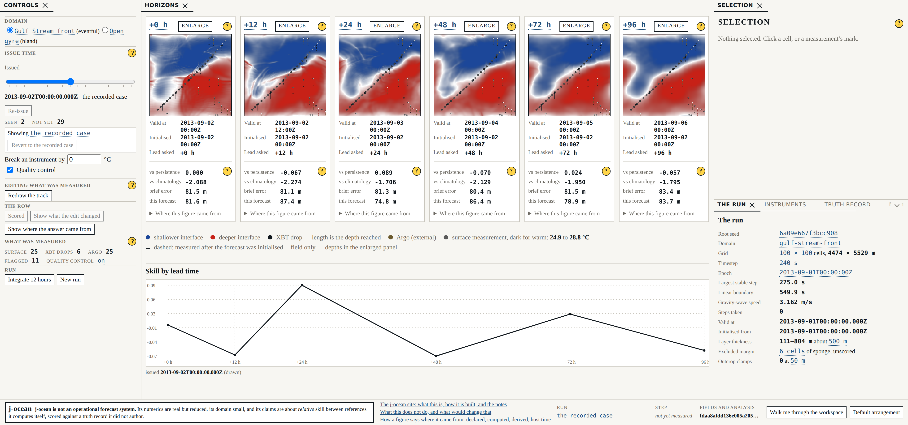

# Beat 018: the surface stops being an article and becomes an instrument

Beats 013 to 017 met every requirement in the interface document and the result still read as
an article. The author put it plainly:

> It has introduced a scrolling pane. The look and feel is still that of a blog article, though
> it uses a scrollable portion to *pretend* to reduce overall height. Consider this as an
> operational SPA, arranged within a js-goldenlayout style layout manager. You can assume the
> screen will be at least 2k pixels wide. But I need deliberately placed controls that do a
> job, not blocks of text that describe what's happening.

Three measurements, taken at 2 560 × 1 440 on beat 017's head, say the same thing with numbers.
A controls column that was a **1 344 px scroller in a 1 440 px window**. **71.9 per cent of the
screen with nothing rendered in it** while the horizon panels were 277 px wide. And a surface
that reported in sentences where an instrument shows a readout:

> *The analysis at this issue instant saw 2 observations; 29 had not happened yet.*

Every one of those was tested and every one of those passed.

## The test that passed while the claim was false

Beat 013's plan wrote: *"Internal scroll is declared, not accidental. A region that may scroll
within itself carries a `data-scrolls` attribute, and the no-scroll test asserts that every
element with a scrolling overflow is one of the declared ones."*

That is a well-tested dodge, and it is beat 007's finding for the third time in this project.
The test proved the scrollers were **intended**. It said nothing about whether the content
should have fitted, and so the six-screen page of the interface document's own §1.1 survived,
folded into a column and stamped legitimate.

"No undeclared scrollbar" is the easy property. The claim is *the content fits, and where it
does not it is a list and not an argument*. So the doctrine is withdrawn and replaced by a
distinction:

**A pane may scroll a list — a profile's levels, a manifest, a term list of figures a reader
scans. A pane may never scroll a body of text.**

The test names the pane and what kind of content it held. And it asserts a third thing beat
013's could not see at all: **nothing is clipped.** A pane whose content does not fit is a
fault whether it scrolls or not, and `overflow: hidden` produces no scrollbar for a scrollbar
test to catch. That is precisely how a surface that does not fit hides from a test that only
counts scrollbars.

## What the surface is now

Five panes in a docking layout manager, divided by what changes when — which was beat 013's
division and was right; it was the CSS grid of fixed tracks that was wrong.

| Pane | What is in it |
|---|---|
| **Controls** | the domain, the issue-time axis, the observation and quality-control toggles, the bias, the editors' entry points, the run's actions |
| **Horizons** | the six panels, **each carrying its own skill figures beneath its own picture**, and the skill curve over lead time beneath the row |
| **Selection** | whatever was last selected — a cell's breakdown, or a profile beside the model's derived one |
| **Provenance** | the run, the instruments, the truth record and the manifest, **as tabs** |
| **Status** | the statement that j-ocean is not an operational forecast system, which run this is, what a step cost against the declared budget, and the digest |

The status strip is deliberately **not** a pane, and that is the one thing in the plan the
built surface argued with. FR-58 says the statement that j-ocean is not an operational forecast
system is visible without interaction and is not the thing moved behind a control — and every
panel in a docking layout manager can be closed, tabbed behind another or dragged into a
corner. So it lives outside the dock, and there is no arrangement a reader can reach in which
it is not on screen.

## Panes take the space; tracks do not

This is the measurable part of the beat.

|  | Beat 017 | Beat 018 |
|---|---|---|
| Dead space at 2 560 × 1 440, row built and scored | **71.9 %** | **56.0 %** |
| A horizon panel at 2 560 | 277 px | **280 px** |
| A horizon panel at the declared floor | 190 px | 190 px |
| The declared floor | 2 038 × 728 | **1 658 × 740** |
| A 2 000 px window | the fallback | **the six-panel row** |

Dead space is measured with one instrument run against both builds: an eight-pixel grid over
the viewport, a cell counted live if any rendered ink falls in it — a text node's own client
rects, a canvas, a control, a drawn shape, a rule along the edge it is drawn on — with clipped
and unpainted content excluded because none of it is painted. A background fill is not ink; an
instrument that counted one would report a blank pane as full.

**The floor is one finding.** Beat 013 measured its floor honestly and got 2 038 × 728, and
828 px of that width was chrome: two 390 px columns and a 48 px gutter, declared unshrinkable
because in a grid of fixed tracks they were. The consequence was that an ordinary 2 000 px
monitor — the author's own — got the below-the-floor fallback. In a workspace the flanking
panes flex, so the floor is built from the width below which a pane cannot be **read**, and the
declared widths are shared down proportionally when a window cannot afford them. The width fell
by 380 px.

The height is the part this beat got wrong on its first pass, and it is the section after next.


## The instrument preferred a surface the requirements forbid

What is left of the 56.0 per cent is reported rather than explained away, and the instrument
says where it is: a selection pane with nothing selected in it (95.6 per cent of its own
rectangle), the slack below the last control (74.1 per cent), and a band 1 750 × 356 px beneath
the skill curve that is 97.6 per cent empty.

That band is the second finding, and it is about the measurement as much as about the surface.
A horizon panel's field is square, so a row of six across 1 731 px is 525 px tall in a pane
1 359 px tall, and nothing short of a taller row or a three-by-two grid uses that height. A
three-by-two grid is not this beat's to choose: ADR-0003 chose one row so that six figures read
left to right show the decay.

So the first pass gave the band to the skill curve, which grew to **698 px to plot six points**
— taller than the row it annotates — and the dead-space figure fell to **42.5 per cent**. The
same tree with the curve at a declared share of the pane measures 56.0. The instrument, in
other words, prefers the surface the requirements forbid, because a stretched plot is ink to a
grid of eight-pixel cells and is not information to a reader.

FR-45 decides it and the instrument does not: *the six panels take the dominant region and the
full width available to it; this is the payload and is given the space accordingly*. The share
the curve may take is `presentation.workspace.skillCurveFraction`, declared like every other
figure of the layout, and a test measures the two rectangles — a horizon panel is 525 px tall
and the curve beneath it is 403. The 13.5 points of dead space that costs are the honest price,
and they are on the page above rather than hidden inside a chart that had nothing more to say.

## The sentences, and the exemption that hid the last two

Zero explanatory sentences on the surface, outside panel help, the walkthrough and the
statement of FR-58.

Beat 014 already claimed that, and its test exempted **any block that carried a figure**. That
exemption is how both of the sentences the author's review named survived four beats: they
carry figures. It is gone. A block is now counted as a sentence when more than eight words
remain after every figure's own text is removed — a label is short by nature, and an
explanation is not.

**And then the same mistake turned up one box smaller.** `.legend` was exempt as a whole block,
which is fair of a legend: a legend labels marks. The legend beneath the row is a paragraph, so
the exemption covered everything inside it, and two explanations of twenty words each were
living under a class that means *this labels a mark*:

> *the row shows the field alone at this size: the attribution layer and each measurement at
> the depth it reached are drawn in the enlarged panel*
>
> *the same field on every panel: this run analyses once, at 2026-09-08T09:00:00.000Z.
> Attribution becomes per horizon when the forecast cycles.*

A class that means *this is allowed* is a licence and not a category — which is exactly what
beat 014 was told about `.aside`. Every **entry** of a legend is counted on its own now, and
the paragraph stays exempt because the paragraph is only its entries. Five clauses moved: two
to the attribution panel's help, one to the row's, and two dropped because the thing they
explained says it better itself. What is left is a label of eight words and one of six.

FR-51 and the no-prose requirement both survive that, which took reading them as asking
different things. FR-51 requires the row to **state** that it is showing the field alone, and it
does: *field only — depths in the enlarged panel*. What the enlarged panel adds, and that
enlarging changes what is shown and never what was computed, is an explanation — and
explanation is help's.

The two the review named became readouts:

```text
The analysis at this issue instant saw 2 observations; 29 had not happened yet.
    →  SEEN 2      NOT YET 29

Drawn over every panel: 25 surface measurements, 6 XBT drops and 25 Argo profiles,
of which 11 carry a flag — drawn as flagged, never omitted. Quality control was on.
    →  SURFACE 25   XBT DROPS 6   ARGO 25   FLAGGED 11   QUALITY CONTROL on
```

The run's provenance went the same way. *"Timestep 900 s from the epoch, inside the 275.0 s the
declared criterion admits (the scheme's linear boundary is 549.9 s). Gravity-wave speed 3.162
m/s"* was five figures joined by connective prose; it is five lines of a term list now. Every
figure is the same figure, with the same kind on it.

**Provenance is relocated, not reduced.** Every figure keeps its declared / computed / derived /
host-time typography, and every score keeps the scorer's own statement — *worse than climatology
by 208.8 per cent*, unsoftened. What changed is where it is. It had been drawn as a two-line
sentence **over the two figures that say the same thing**, so a reader read prose to find two
numbers already beneath it; it is the first line inside *where this figure came from* now, byte
for byte as the scorer produced it. Principle VI is met by the figure rather than by the
sentence, and the test says so in those terms: it reads the skill against climatology as a
**number** with nothing opened and requires it to be negative, and requires the statement not to
be on screen until the disclosure is. And the four figure kinds are now
measured **on rendered pixels**: each is photographed through a real saturation filter and
compared on ink, underline and lean. Beat 017 asserted this by reading the stylesheet, which is
a measurement of the stylesheet; the claim is that a monochrome print still says which kind a
figure is, and a print is made of pixels.

## What is remembered, and what may never be

The workspace remembers how a reader arranged it. That needed the constitution to say something
it had only implied.

Principle IX said *no forecast input or output persists between visits* — and it was written
about runs. A run is a seed and a manifest, and replay is re-computation from a manifest, never
restoration from a snapshot; a persisted run would be a second way to bring a forecast back
with none of the manifest's checks. A persisted pane width is not that. It is a preference
about furniture.

The constitution now draws that line explicitly rather than leaving it to be inferred, because
a reader of Principle IX could reasonably have inferred the opposite, and one did. The shell
test that read *writes nothing to storage, in a whole visit* is narrowed to exactly what that
line allows and not a word further — **one** key, and it is the key configuration declares; no
cookie, no IndexedDB, no session storage, nothing in the address — and every part of it is
still measured by replacing the storage APIs before the page loads rather than promised. And
what is
stored is guarded exactly the way beat 017 guarded the address — a key set, and a planted
`seed` refused by name:

```text
× the workspace grammar > admits exactly version, grid, panels and activeGroup
  → the workspace grammar has changed. It carries furniture only: a fourth kind of key is a
    second persistence mechanism with none of the manifest's checks (Principle IX).
    expected [ 'version', 'grid', 'panels', 'activeGroup', 'seed' ]
    to deeply equal [ 'version', 'grid', 'panels', 'activeGroup' ]

× the workspace grammar > admits exactly id, component and title on a pane
  → a pane's entry has grown a key. The layout manager offers `params` as a place to hang
    arbitrary state on a panel, and that is exactly the door a seed would come through.
    expected [ 'id', 'component', 'title', 'params' ] to deeply equal [ 'id', 'component', 'title' ]

× the workspace grammar > admits no key that names a run rather than a piece of furniture
  → the workspace grammar carries seed, which names the run rather than the furniture. A run
    is a seed and a manifest, and replay is re-computation from the manifest: a stored run
    would be a second way to bring a forecast back, with no code version, no configuration
    digest, and no refusal when the tree has moved (constitution Principle IX).
```

Six tests fail on that planted grammar, in three places that fail on three different mistakes:
the vocabulary, which is how a run key would actually arrive — as an obvious convenience, in a
small diff; the **read**, which is how one arrives from outside this build, put in storage by
an older version or a reader with a console; and the **write**, which *rebuilds* what it stores
from a fixed set of keys rather than filtering, so a new field in the layout manager's own
serialisation cannot reach storage by default.

A browser test plants the seed where it would really be — in storage — and watches the surface
refuse it by name and put the default arrangement back.

## The walkthrough comes back, and the record says so

Beat 016 retired a walkthrough and was right to: a reader confused by attribution wants
attribution explained, not a tour that begins three panels away. That remains true of *what is
this panel*. A workspace of docked panes raises a different question — *what am I looking at* —
and panel help cannot answer it, because the answer is not about any one panel.

So the walkthrough is back, offered and never imposed: no first-visit flag, no storage, nothing
that starts it but a reader pressing the control. Every step names a pane, and a browser test
walks all seven and requires the pane it names to be on the surface.

Two of its steps are **reclaimed** from beat 016's disposition record rather than newly
written, and the record has grown a kind to say so. It could say where matter went; it could
not say that matter had come back. `docs/narrative-disposition.json` now carries `walkthrough`
entries with `previously` and `reclaimedIn`, and the test renders each step and holds the words
against it — the same discipline as the site sections and the help entries, applied in the
other direction.

The below-the-floor answer went the same way, and it was the beat's own blind spot: beat 013's
fallback said the size it needed in **two paragraphs of prose**, which is the fault this beat
exists to fix, arriving in the one presentation nobody was looking at. It is one line now — the
width, as the declared figure it is — and the two paragraphs are a step of the walkthrough,
reachable from that same presentation.

## A floor no browser window reaches

The author opened the preview on an ordinary browser window and got **a 6,584 px scrolling
column beneath a fixed banner** — longer than the 5,757 px page the interface document was
written to kill.

Everything above was measured at 2 560 × 1 440 and 1 920 × 1 080. Those are screen sizes. A
*window* on a 1080-tall screen is about 900 px tall once the browser's own chrome is taken, and
the declared floor was **960 px tall**. So 1 920 × 900, 1 536 × 864 and 2 560 × 900 were all
below the floor, and what was down there was beat 013's answer carried through unchanged: every
pane stacked in one column with a scrollbar down the side.

The census that should have caught it had classified that column as *"a list — the panes, one
under another"*, and the list/prose test believed the classification. **Stacking a whole
application vertically and scrolling it is not a list; it is the page.** That is this beat's own
finding, one box larger: a class that means *this is allowed* is a licence and not a category.

Three things follow, and all three are measured rather than argued.

**The floor is a width.** Six panels at the declared minimum panel width need 1 658 px between
them once the flanking panes have taken the least they can be read at. A short window is short
of height, and height is not what makes a row of six unreadable — measured, too: forced to one
horizon at 1 658 × 735 the horizons pane overflowed by 970 px, where the row it replaced fitted.
So the query that decides what the centre holds asks the width, the line on the surface states a
width, and `minimumViewportHeightPx` goes back to being what a floor is: the height below which
a pane clips.

**The column is deleted, not shortened.** Below the width the row needs, the workspace is the
workspace — the same dock, the same panes, the same status strip — and the centre carries one
horizon with the strip carrying the other five. That is beat 015's enlargement, which was
already the union `CentreContent` forced to `enlarged`; what is gone is the second arrangement
that used to be wrapped around it.

**The height came down from 960 to 740, and what forced 960 was furniture.** Not, as it
happened, any of the things the layout declares: the controls pane's own content was **823 px**
at the 220 px it is narrowest, and the status strip wrapped to two rows and took **110**. A
control surface had been set at a paragraph's line height, its groups separated twice over —
once by a rule and once by a gap — and the strip gave 22 rem of its width to an ellipsised
64-character digest, which left no room for the statement beside it. Set as furniture rather
than as text the controls are **648** and the strip is one row of **66**, and no control, label,
unit or declared bound left the pane. The floor measures **1 658 × 740**.



740 is below 768, which is the shortest laptop in the matrix, and that matrix is now a declared
list that a test walks: 1 366 × 768, 1 536 × 864, 1 920 × 900, 1 920 × 1 080, 2 560 × 900 and
2 560 × 1 440. At every one of them the workspace renders, the row builds and scores, the
document does not scroll, nothing is clipped, and the tallest scroll of any element in any state
is **653 px sideways** at 1 366 × 768 — the horizon strip, which is a list of six controls and
says so on the element. Its slots are held to the width a horizon is legible at, because sharing
a 548 px pane between six of them squeezed each horizon's skill figures down to `0.0` and `-2.`,
and a truncated figure is worse than a scrollbar on a list.

Two faults surfaced only because the census was finally asked at those sizes, and both had been
in the tree since this beat's first pass. The enlarged panel's depth elevation was given its
**intrinsic** height, which for a viewBox of 100 × 170 at a width of 823 px is 1 398 px: it was
laid out 879 px below the pane, painted nowhere, with its depth labels crowded into the top
eighth of it. And the skill curve, which may shrink so the row keeps its room, could be crushed
below its own heading and caption — 30 px of it in a 636 px pane, with the caption hidden by the
`overflow` that was supposed to be protecting the layout. Neither produced a scrollbar for a
scrollbar test to catch, which is the whole reason the census measures clipping.

## What did not change

One digest moved: `configuration`, and only because declared presentation figures changed — the
reference viewport, the floor, the two pane widths, the gutter and the new workspace block. The
other forty are byte-identical for the same seed. G-07 is what says so rather than the person
who did the refactoring, which is the one witness this project never accepts.

## A gate that could not tell "the row disagrees" from "the gate never ran"

G-05 is the one gate that cannot read source. The constitution requires it to check in a
running browser, because a row that has quietly stopped agreeing with its configuration is a
failure source can be read into agreeing with — so it spawns Playwright, which builds the site,
serves it statically and drives a browser.

Midway through this beat it reported:

```text
FAIL  G-05 declared horizons rendered  (0 files scanned)
      tests/gates/declared-horizons.gate.ts:1  the rendered horizons are not the declared ones.
```

The row was in perfect agreement with configuration. A preview server left running by an
earlier command was holding the port, and the gate deliberately refuses to reuse a server it
did not start — a gate asking its question of a build that is not the tree can pass or fail for
reasons nothing in the tree explains. Playwright never opened a browser, and every non-zero
exit was being read as the one failure the gate exists to report.

Nothing about what the gate asserts was relaxed. Two things were added, and the second is the
one that mattered:

- **the exit is classified.** A missing browser, a preview server that would not start, and a
  row that disagrees are three different sentences now. Reporting the first two as the third
  sends whoever reads the log to look for a defect in a row that is correct.
- **a run that executes no tests is a failure.** `scanned` was taken from the `N passed` line
  and defaulted to zero, so a run matching *no tests at all* — a renamed file the project's
  `testMatch` no longer picks up — would have exited zero with no violations and reported a
  **pass over an empty scan**. That is the shape of hole every other gate in this repository
  counts files to avoid, and this one had it because its walk is a browser run rather than a
  directory. It now requires both of its own tests to have run: the assertion, and the planted
  violation that is watched failing beside it.

`gate-lib` has said since beat 001 that "a gate that passes because its walk found nothing is
the most comfortable kind of broken". It printed a note when a gate scanned nothing and passed
it anyway.

## What this cost, and what is owed

`dockview` is the first user-interface dependency this repository has taken. Its styles are
imported rather than vendored and the build is still a static page servable from GitHub Pages.

Two things about it are worth writing down, because both looked like the code working.
`addPanel`'s `initialWidth` is a hint: three panes added in a row came out as equal thirds
whatever it said, which is a geometry nothing declared and which left the horizons pane a third
of the window with the controls pane holding the rest empty. And the layout manager measures
its container asynchronously, so a size set in the same frame as the panes is set against a
container it believes is 100 px wide, and is then thrown away by the first real layout. The
declared widths are applied on the first frame at which the grid's own width is the window's,
and the wait is bounded.

Ninety-one shell tests were written against the region grid and there are 121 now. Their claims
mostly survived and their selectors mostly did not; eight lost their subject outright, and each
is recorded in the plan's `## Measured` against the claim it made rather than deleted. The one worth naming here
is beat 013's *each score is in its panel's column*, which was a claim about CSS `subgrid`
across two regions. Independent panes cannot share tracks. The score is inside its panel now,
which is what FR-46 asked for in the first place and is a stronger statement than the column
test made: a box inside another box cannot be under the wrong one.
